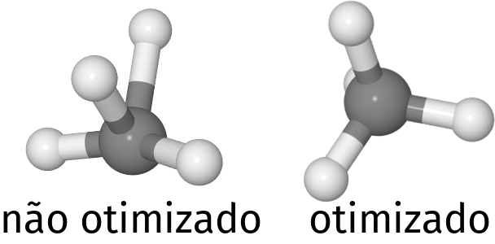
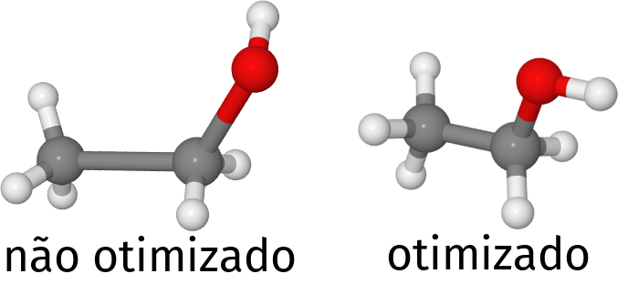
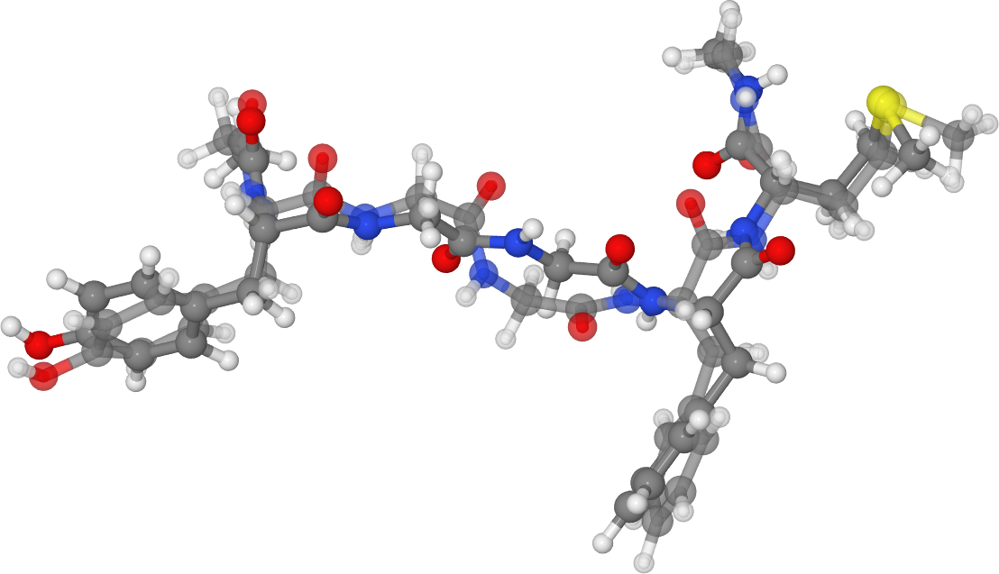
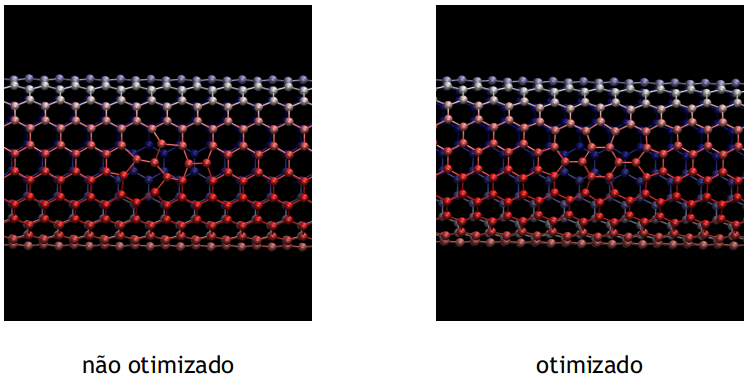

# Introdução a campos de força e ao LAMMPS

Conforme apresentado em aula, a dinâmica molecular clássica é realizada com potenciais de mecânica molecular.
Esses potenciais, chamados de campos de força, descrevem as interações entre os átomos do sistema.

Para entender melhor o funcionamento dos campos de força vamos realizar o cálculo de energia e minimização de energia no LAMMPS.
O LAMMPS, assim como outros programas que realizam dinâmica molecular, lê as coordenadas dos átomos e os parâmetros do campo de força de um arquivo de texto, que é usualmente chamado de **topologia**.

## Objetivo

- Entender a estrutura básica do arquivo de topologia do LAMMPS
- Entender a estrutura básica do arquivo de entrada do LAMMPS
- Realizar a minimização de energia de diferentes sistemas

## Otimização da molécula de metano no campo de força OPLS-AA

A molécula de metano (CH<sub>4</sub>) é descrita em potenciais *all atom* pelo átomo de carbono e os 4 hidrogênios, cada um com seu conjunto de parâmetros de ,  e carga.
Além disso, existem 4 ligações, entre o C e os H, cujos parâmetros precisam ser especificados (constante de mola e distância de equilíbrio), e 6 ângulos H - C - H cujos parâmetros também precisam ser fornecidos.

As coordenadas cartesianas da posição de cada átomo bem como os parâmetros antes mencionados são armazenadas no arquivo de **topologia**.
O arquivo de topologia é um arquivo de texto que pode ter um nome e extensões qualquer, mas tipicamente tem extensão `.data` ou `.lmp` no caso de arquivos para o LAMMPS.

Entre no diretório `metano` e abra o arquivo `metano.lmp`.
Inicialmente são especificados algumas informações como o número de átomos da topologia, número de ligações e de ângulos, diedros etc.
Após isso, temos a informação de quantos tipos diferentes de cada um desses parâmetros temos na topologia, isto é, teremos 2 tipos de átomos (C e H), 1 tipo de ligação (C - H) e 1 tipo de ângulo (H - C - H) para a molécula de metano.
Após isso, temos informações sobre a caixa de simulação, que nesse caso é um paralelepípedo.

Após essas informações adicionais, as informações sobre a massa de cada átomo e os coeficientes do campo de força são especificadas.
Tente entender a estrutura do arquivo.
Note que tudo que está após o símbolo `#` é um comentário, e portanto não é interpretado pelo LAMMPS.

As coordenadas atômicas especificadas na seção `Atoms` podem ser visualizadas no arquivo de estrutura utilizado para a construção da topologia `CH4.pdb` com:

```bash
jmol CH4.pdb
```

Você deve ver uma geometria como a da esquerda na figura abaixo (após a visualização, feche o `Jmol`):



Veja que a geometria não é a esperada para a molécula de metano, pois esperaríamos que a molécula fosse simétrica.
Essas coordenadas foram desenhadas propositalmente nessa condição, para ilustrar o processo de minimização de energia.
Idealmente, tentaríamos deixar a geometria inicial mais próxima da geometria final esperada o possível antes de fazer a minimização, para evitar a minimização para um mínimo local.
Contudo, como essa é uma molécula muito simples, mesmo com uma geometria inicial ruim chegamos a geometria final correta após a minimização.

Com a topologia pronta, temos que criar o arquivo de entrada para a minimização da energia com o LAMMPS.
O LAMMPS, assim como a maior parte dos programas que realiza simulação clássica e/ou cálculos de primeiros princípios de materiais, lê os parâmetros do programa de um arquivo de texto.
Esse arquivo de texto, no caso do LAMMPS, é composto por um conjunto de palavras-chave, seguidas do parâmetro correspondente.
Abra o arquivo `in.lammps` para visualizar o arquivo de entrada para a minimização da molécula de metano.

Novamente, tudo à direita do símbolo `#` é considerado comentário.
Leia e tente entender o arquivo.
Veja que temos que especificar diversas informações para fazer a simulação, desde as unidades e informações sobre o campo de força, até informações sobre o que será dado como saída no arquivo final, onde estarão os resultados.

Neste arquivo de entrada, queremos fazer a minimização de energia.
Para isso, utilizamos a palavra-chave `minimize`, seguida dos parâmetros utilizados na minimização, como o critério de convergência de força e energia utilizado para finalizar a simulação e o número máximo de passos.
Para entender mais o que cada comando do arquivo faz, procure-os no [Manual do LAMMPS](https://lammps.sandia.gov/doc/Manual.html).

Vamos agora executar a simulação.
Para isso, utilizamos o comando:

```bash
lammps < in.lammps
```

A minimização deve acontecer em menos de 1 segundo.
Tente entender a saída que apareceu na tela.
Atente para o trecho:

```
Step PotEng 
       0    80.234393 
      46   0.16800073 
```

Neste trecho, podemos ver que após 46 passos de minimização, a energia potencial baixou mais de 80 kcal/mol.
Para visualizar a geometria final, utilize:

```bash
jmol min.xyz
```

Você deve ver algo como no lado direito da figura acima, uma molécula simétrica.


## Otimização da molécula de etanol no campo de força OPLS-AA

Vamos agora realizar a minimização de energia da molécula de etanol.
Para isso, entre no diretório `EtOH`.
Vamos visualizar a geometria inicial, contida no arquivo de topologia:

```bash
jmol EtOH.pdb
```

Você deve visualizar algo como o mostrado no lado esquerdo da figura abaixo.



Feche o `Jmol` e abra o arquivo de topologia `EtOH.lmp` para visualizá-lo.
Note a maior complexidade dessa topologia, que contém além dos termos da topologia do metano, termos de diedro.
Observe também que apesar de serem dois carbonos na estrutura, que esses dois carbonos são diferentes.
Isso é visto pela carga de cada um deles.

Visualize agora o arquivo de entrada para a minimização do etanol `in.lammps`.
Tente entender as diferenças (que são sutis) entre esse arquivo e o do metano.

Execute a simulação:

```bash
lammps < in.lammps
```

E observe o quanto a energia baixou e a geometria final da molécula.


## Otimização de um peptídeo 5-mer descrito com o CHARMM

Vamos agora fazer a minimização de um peptídeo com 5 aminoácidos.
Entre no diretório `peptide` para seguir com o tutorial.

Visualize agora a topologia do peptídeo (não se preocupe em visualizar a estrutura inicial nesse momento, ela será escrita durante a simulação).
Esta topologia foi adaptada de um dos exemplos do LAMMPS, que se encontra no diretório `examples` quando você faz o download do [código fonte](https://github.com/lammps/lammps) pelo GitHub.
Note a complexidade muito maior da topologia, que possui mais tipos de átomos, ligações, ângulos e diedros, e que agora também introduz diedros impróprios.
Muito provavelmente, essa topologia foi construída com o auxílio de alguma ferramenta como o [TopoTools](https://sites.google.com/site/akohlmey/software/topotools), o [MolTemplate](http://www.moltemplate.org/) ou o [LigParGen](http://zarbi.chem.yale.edu/ligpargen/).

**IMPORTANTE**: Se utilizar alguma ferramenta automática para a construção da topologia, *SEMPRE* verifique se a topologia gerada está correta. Se a topologia estiver errada, *TODA* a simulação é inválida.

Depois de visualizar a topologia, abra o arquivo de entrada do LAMMPS.
Compare com os arquivos anteriores.
Note que o campo de força utilizado dessa vez é o CHARMM, o que implica que a forma funcional do potencial também muda.
Essa mudança é especificada no arquivo de entrada.

Para executar a minimização de energia, execute novamente:

```bash
lammps < in.lammps
```
Observe a mudança na energia potencial após a minimização.
Note também que dois arquivos, com as estruturas inicial e final, são criados.
Visualize as estruturas.
As mudanças não são tão grandes, como é mostrado numa superposição das duas configurações na figura abaixo:



A estrutura inicial é a com transparência, enquanto a final é a opaca.

## Otimização de um nanotubo de carbono com defeito topológico descrito pelo AIREBO

Nos exemplos anteriores realizamos a minimização de energia de moléculas descritas por campos de força que possuem forma funcional onde ligações covalentes, ângulos, diedros e diedros impróprios precisam ser explicitamente declarados na topologia.
Devido ao potencial harmônico presente nas ligações covalentes, não é possível romper ligações nesse tipo de potencial.
Por esse motivo, em simulações que se deseja observar a formação ou quebra de ligações químicas, é necessário o uso de potenciais reativos.

Esses potenciais, em geral, são mais custosos computacionalmente, e dependendo da propriedade de interesse, não necessariamente fornecem a melhor descrição para o sistema.
Contudo, a flexibilidade de poder trabalhar com a quebra de ligações é fundamental em alguns casos, como no estudo de curvas de *stress vs strain*, onde o sistema é esticado até romper.

Nesta parte do tutorial vamos utilizar o potencial AIREBO, que é um potencial reativo e tem as características mencionadas anteriormente.
Iremos realizar a otimização de energia de um nanotubo de carbono com um defeito topológico.
Esse defeito, foi gerado à partir do nanotubo pristino, removendo dois átomos e realizando o que seria a rotação de duas ligações (que não são explícitas nesse caso).
Ao introduzir o defeito, precisamos que o sistema relaxe para a configuração de mais baixa energia com aquele defeito, se quisermos realizar outras simulações com esse nanotubo.

Entre no diretório `CNT` e primeiramente visualize a estrutura do nanotubo com `jmol CNT.xyz &`.
Encontre o defeito na estrutura.
Após isso, feche o `jmol` e visualize a topologia (`CNT.data`).
Repare como não declaramos *bonds*, *angles* e *torsionals*.

Agora abra o arquivo de entrada do LAMMPS `in.lammps` e tente entendê-lo.
Veja como na parte do potencial o AIREBO é definido como `pair_style`, e que no `pair_coeff` (onde colocaríamos as constantes do potencial) é feita a referência a um outro arquivo, o `CH.airebo`.
Este arquivo não foi feito por nós, mas sim pelos autores do potencial. 
Arquivos desse tipo são normalmente disponibilizados juntos com os artigos onde os potenciais desenvolvidos são apresentados.
Após tentar entender o `in.lammps`, visualize o arquivo do potencial.
Tentar entender o conteúdo do `CH.airebo` está fora do escopo deste tutorial, mas pense que assim como utilizávamos os `pair_coeff` para fixar os valores do epsilon e sigma do potencial de Lennard-Jones, o arquivo contém as constantes necessárias da parametrização dessas interações.

Finalmente, execute a minimização de energia com:
```bash
lammps < in.lammps
```

Veja que a minimização vai demorar alguns segundos para terminar.
Este aumento do tempo de CPU não é somente pelo maior número de átomos, ele ocorre principalmente pelo custo computacional do AIREBO.
Veja a diferença de energia entre a estrutura final e inicial (se atente para as unidades!).

Agora visualize as estruturas `inicial.xyz` e `final.xyz` lado a lado para tentar enxergar as mudanças.
Você deve observar algo como na figura abaixo:



Note que os comprimentos de ligação e ângulos foram ajustados de modo que a estrutura final é mais simétrica.

