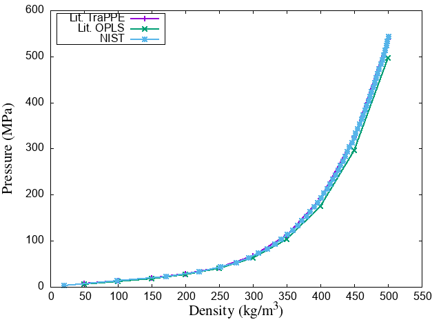
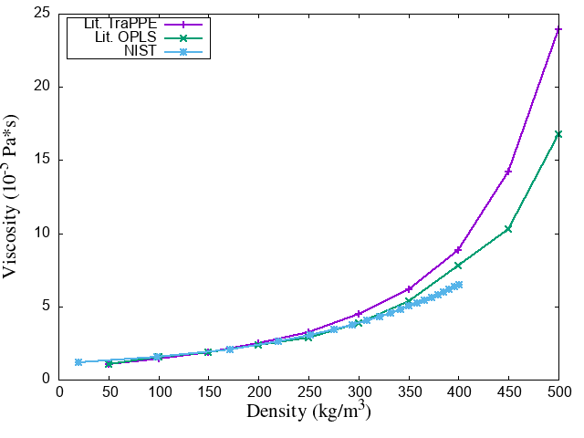
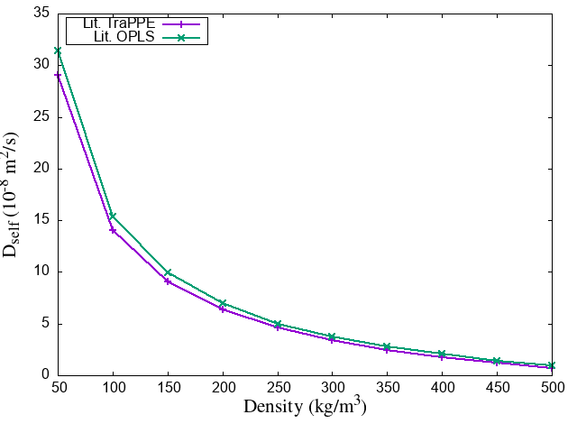

# Simulação de metano em alta pressão com dinâmica molecular

Neste laboratório vamos estudar o comportamento do metano na fase supercrítica (alta pressão).
Para isso, vamos utilizar simulações de dinâmica molecular e comparar os resultados obtidos com resultados disponíveis na literatura, experimentais e de simulação.
Este laboratório dá sequência ao [laboratório 2](../lab2), tenha certeza de ter entendido o conteúdo antes desse laboratório antes de prosseguir.

Estaremos interessados em observar propriedades de transporte, que são dependentes do tempo e só podem ser calculados com dinâmica molecular (não podemos utilizar Monte Carlo).
Especificamente, vamos calcular o coeficiente de auto-difusão e a viscosidade nas diferentes condições de simulação.
Para isso, faremos simulações no ensemble *NVT*, simulando em diferentes densidades.
Como o volume é mantido constante nesse tipo de simulação, diferentes densidades são equivalentes a diferentes pressões.
Nesse caso, a pressão será uma das propriedades que podemos obter com a simulação, diferente de simulações no *ensemble* *NPT*, onde a pressão é controlada por um barostato.

## Objetivos

- Introduzir o aluno à simulações com dinâmica molecular.
- Realizar uma simulação do gás metano em alta pressão, obtendo a distribuição radial de pares, o coeficiente de auto-difusão com a relação de Einstein e a viscosidade com Green-Kubo.

## Simulação de metano considerando diferentes temperaturas e pressões

Para obter curvas de como as propriedades que estudaremos variam com a temperatura e pressão, cada aluno vai realizar a simulação em uma temperatura e densidade conforme a tabela abaixo.

Aluno | Temperatura (K) | Densidade (kg/m<sup>3</sup>)
----- | --------------- | ------------------
1     | 273.15          | 25
2     | 273.15          | 50
3     | 273.15          | 75
4     | 273.15          | 100
5     | 273.15          | 150
6     | 273.15          | 200
7     | 273.15          | 250
8     | 273.15          | 300
9     | 273.15          | 350
10    | 273.15          | 400
11    | 273.15          | 450
12    | 273.15          | 500
13    | 303.15          | 25
14    | 303.15          | 50
15    | 303.15          | 75
16    | 303.15          | 100
17    | 303.15          | 150
18    | 303.15          | 200
19    | 303.15          | 250
20    | 303.15          | 300
21    | 303.15          | 350
22    | 303.15          | 400
23    | 303.15          | 450
24    | 303.15          | 500

## Arquivos de entrada para a simulação

Como cada aluno deverá simular em uma diferente condição termodinâmica, os arquivos de entrada deverão ser preparados adequadamente para cada caso.

### Topologia

Conforme visto no laboratório anterior, o arquivo de topologia contém as informações sobre a composição do sistema e como os átomos do sistema interagem.
Como estaremos estudando o mesmo sistema, a parte de topologia que descreve as interações será a mesma.
Entretanto, fixado um número de moléculas, como as simulações ocorrerão em diferentes densidades, teremos diferenças com relação ao tamanho da caixa de simulação para obter a densidade desejada.
Na próxima seção explicaremos como determinar o lado da caixa.

Abra o arquivo `metano.lmp`, visualize a topologia e compare a topologia da molécula de metano do [laboratório 2](../lab2).
Você deve notar que a topologia `metano.lmp` utilizada neste exercício possui **um único átomo**!
Isso é devido a uma aproximação adicional, que estamos fazendo para reduzir o custo computacional.
Utilizaremos nesse laboratório um modelo **united atom (UA)** para o metano.

Este tipo de modelo, utiliza-se do fato de que os hidrogênios de hidrocarbonetos interagem pouco com outros átomos e moléculas (por exemplo, não formam ligação de hidrogênio) para incluí-los de maneira efetiva no potencial do carbono.
No caso do metano, isso significa que temos um único "átomo" do tipo `CH4`.
Esse átomo `CH4` possui a massa da molécula de metano e um  e  diferentes do carbono simples, para tentar compensar pela falta de átomos de hidrogênio na molécula.

Utilizar modelos UA significa reduzir consideravelmente o custo computacional da simulação.
Isso porque temos menos átomos interagindo (neste caso apenas 1/5 dos átomos), e também porque podemos utilizar um *timestep* para integração ligeiramente maior, já que não precisamos considerar o tempo característico das vibrações dos átomos de hidrogênio.
Por esses motivos, utilizaremos esse potencial para essa simulação.

Contudo, potenciais UA podem simplificar exageradamente a molécula e interferir nos valores médios de algumas propriedades.
Por exemplo, no cálculo da viscosidade que faremos neste tutorial, teremos um valor da propriedade ligeiramente superestimado, especialmente para densidades acima de 200 kg/m<sup>3</sup>.
Por esse motivo, deve-se sempre considerar quais as propriedades de interesse e condições da simulação no momento da escolha do campo de forças.

Outro detalhe interessante sobre essa topologia é que temos somente uma molécula de metano.
Mesmo utilizando condições periódicas de contorno, não seria possível simular um ensemble de um gás ou líquido de metano com somente uma molécula.
O motivo de termos somente uma molécula na topologia, é que utilizaremos nosso arquivo de entrada `in.lammps` para replicar a topologia 6 vezes em cada direção, o que nos dará uma caixa de simulação com 216 moléculas, o que é o suficiente para as amostragens que faremos aqui.
Sendo assim, para a nossa caixa de simulação construída com as réplicas ter a densidade desejada, precisamos que a unidade utilizada para construí-la tenha essa densidade.

#### Determinando o tamanho da caixa

Como a caixa de simulação é gerada replicando uma caixa com somente uma molécula de metano, precisamos calcular o volume ocupado por essa molécula considerando uma certa densidade.
Para isso calculamos o volume molar do metano (V<sub>m</sub> = massa molar/densidade), e dividimos pelo número de Avogadro, obtendo então o volume ocupado por uma molécula.
Com isso, podemos calcular qual o lado *L* de uma caixa cúbica contendo uma única molécula de metano que resulta na densidade desejada:

Å

sendo  a densidade de metano (em kg/m<sup>3</sup>) desejada para a simulação.

**Altere a topologia** para que a caixa tenha lado igual ao calculado considerando a densidade em que fará sua simulação.

### Cálculo de propriedades e parâmetros da simulação

Com a topologia pronta, precisamos agora do arquivo de entrada contendo as palavras-chave do LAMMPS, que dará os parâmetros e condições da simulação, bem como quais propriedades serão calculadas.

Estamos interessados em obter a pressão média, o coeficiente de auto-difusão e a viscosidade do metano com a nossa simulação.

#### Coeficiente de auto-difusão com a relação de Einstein

Costumamos pensar em difusão como o processo que ocorro quando há um gradiente de concentração de uma certa partícula que leva ao equilíbrio onde há uniformidade.
Contudo, mesmo em um líquido em equilíbrio, as moléculas não estão paradas, mas sim em movimento Browniano.
Esse movimento, leva ao conceito de auto difusão, denominada aqui por *D*.

Esse coeficiente pode ser obtido tanto utilizando as velocidades (na formulação de Green-Kubo) ou as posições das partículas (pela relação de Einstein).
Ambos os coeficientes deveriam, em princípio, ser equivalentes. 
Usaremos aqui a relação de Einstein para o cálculo do coeficiente de auto-difusão do metano nas condições simuladas.

Para calcular o coeficiente de auto-difusão com a relação de Einstein, precisamos calcular o desvio quadrático médio (MSD) das posições das partículas em função do tempo.
O MSD é proporcional ao tempo de observação conforme o tempo vai a infinito.
Essa proporcionalidade é dada pela constante de auto-difusão *D*, que em 3 dimensões é dada por:


onde `r(t)` é o deslocamento da molécula em relação a posição inicial em `t = 0`.
Note na equação acima que o coeficiente angular dividido por 6 é igual a *D* quando o tempo vai para infinito.
Na prática, calculamos *D* armazenando o valor do MSD em diversos tempos, e depois fazendo um ajuste linear a curva `t vs MSD`.

#### Viscosidade com a fórmula de Green-Kubo

Outra propriedade que estamos interessados em calcular é a viscosidade.
A viscosidade é uma propriedade de transporte que caracteriza a resistência de um fluido ao escoamento.
Podemos computar a viscosidade com uma simulação de molecular utilizando a formulação de Green-Kubo, que utiliza a função de correlação das componentes do tensor de *stress* conforme a equação abaixo.


onde *V* é o volume da caixa; *T* é a temperatura do ensemble; k<sub>B</sub> a constante de Boltzman; P<sub>xy</sub> são os termos não diagonais do tensor de *stress*, sendo que o termo dentro da integral representa a função de correlação do tensor de *stress*.

#### Arquivo in.lammps

O arquivo de entrada que utilizaremos para as simulações do metano, apesar do potencial mais simples com relação aos do [laboratório 2](../lab2), é ligeiramente mais complexo que os arquivos de entrada utilizados para a minimização de energia.
Nesse caso, temos que definir além do potencial de interação, as propriedades que queremos calcular e como faremos a integração das equações de movimento.
Também separamos a simulação em fase de termalização, onde temos a equilibração do sistema e fase de produção, onde as propriedades são de fato calculadas.

Para facilitar a mudança de alguns parâmetros da simulação, foram definidas variáveis no começo do arquivo.
**Altere a temperatura** para a temperatura em que fará a simulação conforme a tabela acima.
Mude também a *seed* do gerador de números aleatórios.
A *seed* é um número utilizado para inicializar o gerador de números aleatórios que, por sua vez, inicializa as velocidades.

Sobre o campo de força, note que temos uma interação somente com o potencial de Lennard-Jones, especificada na keywork `pair_style`.
Como estamos utilizando um potencial UA onde a molécula é representada por uma única partícula (que tem carga zero, assim como a molécula) não temos de nos preocupar com a interação Coulombiana.
Note também que após ler a topologia, replicamos o sistema 6 vezes em cada direção com a keyword `replicate`.

Leia o restante do arquivo, e tente entender como é definido o tipo de simulação (neste caso, no ensemble *NVT*) e como as propriedades são calculadas.
Não se preocupe em memorizar as palavras chave, mas tente entender cada uma delas.
Para isso, verifique qual a função de cada uma no [Manual do LAMMPS](https://lammps.sandia.gov/doc/Manual.html).
Note a função dos `compute` e dos `fix` para definir o que ocorre na simulação.

## Executando a simulação

Antes de executar as simulações, certifique-se de que alterou o tamanho da caixa de simulação e a temperatura para realizer a simulação nas condições conforme a tabela.

Devido ao cálculo do coeficiente de auto-difusão e da viscosidade, temos de executar uma simulação por no mínimo alguns nanosegundos.
Isso implica em um tempo total de CPU para realizar a simulação de até 30 minutos (com 2 processadores), para algumas das condições simuladas.
Por esse motivo, se possível, disponibilize 2 processadores para a máquina virtual nas configurações e execute a simulação com:

```bash
nohup mpirun -np 2 lammps < in.lammps > out.lammps &
```
após entrar com o comando, pressione `Enter` duas vezes para liberar o terminal enquanto a simulação executa no fundo.

Caso não seja possível utilizar dois processadores, execute o comando acima sem o `mpirun -np 2`.

Acompanhe a execução da simulação no arquivo `out.lammps`.
Visualize o arquivo (ou parte dele) com um dos comandos abaixo e aguarde até o término da simulação:

```bash
tail out.lammps
less out.lammps
more out.lammps
```

A simulação terá terminado com sucesso quando a última linha começar com `Total wall time:`, indicando o tempo total gasto para realizar a simulação.

## Analisando os resultados

Vamos agora colocar os resultados obtidos na [**PLANILHA DO TUTORIAL**](https://docs.google.com/spreadsheets/d/1QZ8aAl9Badit1GjiGgZIxhBJYMW4YH85lrDjnc5lUog/edit?usp=sharing) para poder comparar nossos resultados com resultados experimentais e de outras simulações.
Mas antes disso, vamos nos certificar de que a simulação de produção de fato amostrou de uma distribuição de equilíbrio.
Para isso, vamos analisar a evolução da temperatura, energia e pressão com o tempo, e verificar que todas **oscilam em torno de um valor médio** durante a simulação de produção.

Podemos analisar as curvas olhando para a evolução temporal dos valores instantâneos.
Os valores impressos no arquivo `out.lammps` durante a simulação representam os valores instantâneos da propriedade naquele passo de simulação (com exceção da viscosidade, onde imprimimos o valor médio acumulativo com o `ave running`).
Temos então que graficar esses valores para acompanhar a evolução temporal de cada um deles.

Para isso utilizaremos o *script* `lammps_plotter.py`, que está no diretório `utils`.
No script, selecionamos quais colunas queremos graficar, juntamente com qual das simulações queremos graficar.
Para cada comando `run` no input, o *script* interpreta como uma simulação.
Portanto, a "simulação 1" é a termalização, e a "simulação 2" é a etapa de produção.
No diretório onde se encontra o arquivo `out.lammps` execute os comandos abaixo para plotar informações referentes a termalização (de 100000 passos = 100 ps):

```bash
python ~/scm2020/lab3/utils/lammps_plotter.py out.lammps 1 2 --simulation 1
```
Para plotar evolução da temperatura função do passo de simulação (tempo em fs).

```bash
python ~/scm2020/lab3/utils/lammps_plotter.py out.lammps 1 5 --simulation 1
```
Para plotar a energia total em função dos passos de simulação e

```bash
python ~/scm2020/lab3/utils/lammps_plotter.py out.lammps 1 6 --simulation 1
```
Para graficar a pressão.

Arquivos de saída no formato `plotter_1_X.pdf` serão gerados, onde o `X` representa a coluna referente àquela propriedade.
Abra os arquivos para a visualização utilizando:
```bash
evince plotter_1_X.pdf &
```
Renomeie esses arquivos para um nome mais significativo (como `temperatura_termalizacao.pdf`) utilizando o comando `mv`.

Repita o mesmo para as colunas `1 2`, `1 3` e `1 5` da simulação 2 (fase de produção).
Você obterá gráficos para a temperatura, pressão e viscosidade, respectivamente (veja o arquivo de saída e conte as colunas para verificar).
Analise esses gráficos, especialmente o da viscosidade.
Perceba como a convergência do valor médio da viscosidade é muito mais lento que o das outras propriedades.

Como vimos que o valor final da viscosidade está já próximo de convergir, e também que os valores instantâneos das propridades termodinâmicas oscilam em torno de uma média, podemos considerar agora os valores finais das propriedades que temos interesse.
No nosso arquivo de entrada do LAMMPS, pedimos para as médias finais da pressão e viscosidade serem impressas no final da simulação.
Veja quais são os valores obtidos utilizando:
```bash
grep Average out.lammps
```
Copie os valores obtidos para a [**PLANILHA DO TUTORIAL**](https://docs.google.com/spreadsheets/d/1QZ8aAl9Badit1GjiGgZIxhBJYMW4YH85lrDjnc5lUog/edit?usp=sharing).

Vamos agora obter o coeficiente de auto-difusão *D*.
Note que no arquivo de entrada, escrevemos o MSD no arquivo `msd-ch4.dat`, onde temos os resultados de MSD por passo de simulação.
Copie o *script* `msd.gps` que se encontra na pasta `scripts` para o diretório com o arquivo `.dat`.
Execute o *script* para graficar a curva e também realizar o ajuste linear, obtendo o valor de *D*:
```bash
gnuplot msd.gps
```
Visualize o arquivo com `evince msd.pdf &` e preencha o valor de *D* na [**PLANILHA DO TUTORIAL**](https://docs.google.com/spreadsheets/d/1QZ8aAl9Badit1GjiGgZIxhBJYMW4YH85lrDjnc5lUog/edit?usp=sharing).

## Unindo os dados das diferentes densidades

Com a [**PLANILHA DO TUTORIAL**](https://docs.google.com/spreadsheets/d/1QZ8aAl9Badit1GjiGgZIxhBJYMW4YH85lrDjnc5lUog/edit?usp=sharing) totalmente preenchida vamos comparar os resultados obtidos com os resultados disponíveis na literatura.
Para a pressão e viscosidade compararemos com [dados de simulação](https://doi.org/10.1063/1.4896538) de dois diferentes potenciais utilizados para descrever o metano (o TraPPE que usamos e o OPLS) e dados do [NIST](https://webbook.nist.gov/cgi/cbook.cgi?ID=C74828&Mask=4).
Já o coeficiente de auto-difusão será comparado apenas com os dados dos dois potenciais, já que o NIST não disponibiliza dados para essa propriedade.

Na pasta `docs` estão os dados que utilizaremos para a comparação.
Copie os dados referente a temperatura que quer graficar para um diretório novo, juntamente com os scripts `comp_diff.gps`, `comp_pres.gps` e `comp_visc.gps` que estão no diretório `scripts`.
Neste diretório, crie um documento de texto chamado `sim_data.dat`, copie as colunas da [**PLANILHA DO TUTORIAL**](https://docs.google.com/spreadsheets/d/1QZ8aAl9Badit1GjiGgZIxhBJYMW4YH85lrDjnc5lUog/edit?usp=sharing) selecionando os valores e colando no documento de texto, de modo que o arquivo ficará como:

```
25  3.69318994754743  0.943466944878371 59.1383
50  7.0276858290188   1.34414639344123  28.6355 
.
.
.
```

Sendo a primeira coluna a densidade, a segunda a pressão, a terceira a viscosidade e a quarta o coeficiente de auto-difusão.
Note que é a mesma sequência da planilha, por isso é só copiar e colar.

Abra os arquivos `.gps` e certifique-se que eles fazem referência aos nomes de arquivo correto, isto é, para plotar os dados da temperatura de `303.15 K` você precisará substituir `273.15` por `303.15` dentro de cada arquivo.

As curvas, não considerando os dados gerados por vocês, devem ter a seguinte forma:

- Pressão:


- Viscosidade:


- Coeficiente de auto-difusão:



Veja o excelente acordo para a pressão e o bom acordo para a viscosidade, especialmente para baixas densidades.
Os desvios da viscosidade para altas densidades são maiores para potenciais UA, conforme discutido [na literatura](https://doi.org/10.1063/1.4896538).

Em princípio, os dados gerados nas nossas simulações deveriam coincidir com os da curva `Lit. TraPPE`.
Contudo, vocês devem observar alguns desvios com relação a essa curva, mesmo que o potencial utilizado seja o mesmo.
Vocês conseguem explicar esses desvios? 

## Extra

Também salvamos os dados referentes a distribuição radial de pares (g(r)).
Utilize o *script* `gr.gps` para fazer um gráfico.

A sua g(r) se parece com a de um gás ou de um líquido?
Veja o [diagrama de fase do metano](https://media.cheggcdn.com/study/95d/95d4dd24-1f9c-43f6-9470-3d2529ac88bc/13347-11.5SE-2IPE1.png) e tente encontrar o ponto que simulou.
