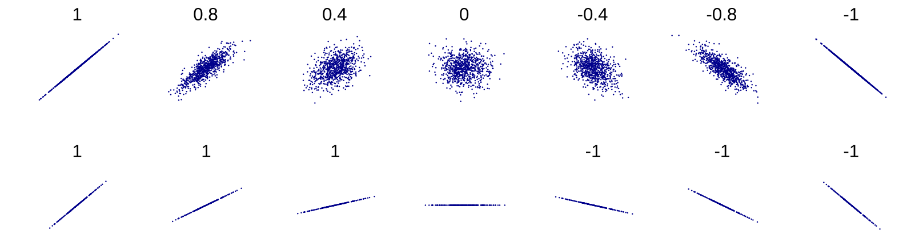

# Simulação Computacional dos Materiais - IFUSP
# Aula Aprendizado de Máquina 2 - Aprendizado não supervisionado

Técnicas de aprendizado de máquina não-supervisionado são utilizadas no processamento de dados. Em projetos de ciência de materiais, tais ferramentas são usualmente empregadas na primeira etapa do projeto, para análise e seleção de variáveis.

Nessa aula, vamos utilizar um banco de dados do pacote **scikit-learn** que trata da progressão da diabetes em 442 pacientes. Essa base possuí dez variáveis descritivas como o índice de massa corporal, pressão arterial e seis indicadores obtidos por meio de exames de sangue. A variavel alvo ('y', coluna 11) é uma variável numérica que representa a progressão da doença em 1 ano. Para mais informações, [acesse a documentação](https://scikit-learn.org/stable/datasets/).


### 1) Checando dependências e carregando o banco de dados

Verifique se sua instalação do python 3.8 possui das bibliotecas pandas, scikit-learn, matplolib e seaborn.

> pip3 list
> pip install ... 

Caso alguma delas esteja faltando, instale-a utilizando o comando **pip install**.
Abra um novo arquivo e salve-o como **am2.py**.

> vim am2.py

Copie o código em seguida e salve o arquivo:

```python
#!/usr/bin/env python

'''am2.py: Código 2 utilizado na aula sobre AM'''

__author__     = 'Nome'
__email__      = 'email'

# Importando bibliotecas
import pandas as pd
from sklearn.datasets import load_diabetes

# Essas bibliotecas são necessárias para fazer os gráficos
import matplotlib
import matplotlib.pyplot as plt
import seaborn as sns

## Sec 1. Carregando o banco de dados

x = load_diabetes()
target = 'Y'

# Definindo um título para cada coluna/var
df = pd.DataFrame(x.data, columns = x.feature_names)

print ('\n-- Dados iniciais --\n')
df[target] = x.target    # define a var-alvo
X = df.drop(target, 1)   # X será a matriz de var (features)
y = df[target]           # y será a var-alvo
print(df.head())         # imprime as primeiras linhas do banco de dados 'df'

# Exportando o banco de dados "df" para *.csv - ocpional
df.to_csv(r'Diabetes.csv', index = None, header = True)

# Normalizando os dados
# from sklearn.preprocessing import MinMaxScaler
# scaler = MinMaxScaler(feature_range=(0, 1))
# X = pd.DataFrame(scaler.fit_transform(X), columns=X.columns, index=X.index)

# Imprimindo a matriz de var X (inicial)
print('\nHá {} variáveis descritivas:\n{}'.format(X.shape[1], X.columns.values))

```

Se você estiver utilizando o vim, pressione Ctrl+C, digite **:wq**, e pressione enter para salvar o arquivo. Depois disso, abra o terminal e execute o código. O programa deve retornar uma breve descrição do banco de dados. No diretório do código, o programa irá salvar uma versão *.csv* do banco de dados:

> python3 am2.py


### 2) Correlação de Pearson

O coeficiente de correlação de Pearson (PCC) mede o fator de correlação linear entre duas variáveis, retornando um valor entre -1 e 1. Ele é calculado a partir da covariância de cada par de variáveis (alvo-descritiva, y-x), dividida pelo produto de seus desvios-padrão. Uma ilustração do coeficiente de Pearson pode ser observada abaixo.



Fonte: https://en.wikipedia.org/wiki/Pearson_correlation_coefficient

Agora que já conhecemos mais sobre o PCC, vamos seguir com a implementação em python. Copie e cole os trechos abaixo no arquivo **am2.py** e depois execute o código:

```python
## Sec 2. Correlação de Pearson

print ('\n-- Seção 2 --\n')
cor = df.corr()         # obtém a matriz de correlação

# Verifica a correlação com a var-alvo 'MEDV'
cor_target = abs(cor[target])
cor_target = cor_target.sort_values()

# Plotando a matriz de correlação
sns.heatmap(cor, annot=True, cmap=plt.cm.coolwarm)    # cores divergentes
# sns.heatmap(cor, annot=True, cmap=plt.cm.cubehelix) # cores lineares
plt.show()    # plota a matriz 

# Seleciona vars (features) que possuem alta correlação (>0.4) com a var-alvo
relevant_features = cor_target[cor_target>0.4]
print ('As variáveis com maior PCC em relação a var-alvo são:')
print ('{}\n'.format(relevant_features))

# Algumas var descritivas são fortemente correlacionadas (indesejado)
print ('As variáveis com maior PCC em relação a BMI são:')
cor_BMI = abs(cor['bmi'])
cor_BMI = cor_BMI.sort_values()
print (cor_BMI[cor_BMI > 0.4])

# Outro jeito de verificar as correlações (matriz textual)
print ('\nA correlação entre BMI e s5 (lamotrigina) é:')
print(df[["bmi","s5"]].corr())

```

Quais são variáveis podem ser consideradas as mais importantes? Há alguma variável que parece redundante? Comente sobre a correlação entre BMI e s5.

Dica: use as duas paletas de cores para visualizar a matriz


### 3) Regressão linear

O objetivo final desse projeto é realizar uma regressão e obter um modelo que possa prever a evolução da diabetes com base no grupo de variáveis descritivas proposto. Normalmente, um modelo de regressão linear é simples demais para descrever problemas tão complexos, mas ele pode fornecer uma boa base de comparação. Ao realizar um ajuste linear (*fitting*), é possível recuperar a importância relativa de cada variável para o modelo, como mostrado abaixo:

```python
## Sec 3. Regressão linear (univariável)

print ('\n-- Seção 3 --\n')
from sklearn.feature_selection import SelectKBest
from sklearn.feature_selection import f_regression

bestfeatures = SelectKBest(score_func=f_regression, k=5)
fit = bestfeatures.fit(X, y)
dfscores = pd.DataFrame(fit.scores_)
dfcolumns = pd.DataFrame(X.columns)

# concatena os dois dataframes para facilitar a visualização
featureScores = pd.concat([dfcolumns, dfscores], axis=1)
featureScores.columns = ['Variável','Score']    # nome para as colunas
print('Seleção univariável:')
print(featureScores.nlargest(10,'Score'))    # 10 melhores parâmetros

# Plotando para melhor visualização

feature_scores = pd.Series(fit.scores_, index=X.columns)
feature_scores.nlargest(5).plot(kind='barh')
plt.title('Variáveis selecionadas via regressão univariável (SelectKBest)')
plt.show()

```

### 4) Regressão linear com penalização (LASSO)

Uma das melhores maneiras de melhorar a capacidade preditiva de modelos lineares é utilizar técnicas de penalização para buscar soluções mais esparsas, i.e. evitar que o modelo fique dependente de apenas 1 variável. A regularização LASSO (penalização L1) limita a soma dos valores absolutos dos coeficientes de regressão, forçando alguns coeficientes à zero. Isso possibilita melhorar a capacidade preditiva do modelo, simplificando-o. Para saber mais sobre penalizações, acesse esse artigo do [Datacamp](https://www.datacamp.com/community/tutorials/tutorial-ridge-lasso-elastic-net). Alternativas para essa etapa seriam utilizar outras técnicas de regularização, como RidgeRegression e ElasticNet.


Fonte: https://datacamp.com


A implementação pode ser encontrada abaixo:

```python
## Sec 4. Penalização
print ('\n-- Seção 3 --\n')
from sklearn.linear_model import LinearRegression
from sklearn.linear_model import LassoCV, Lasso

reg = LassoCV(cv=5)
reg.fit(X, y)
print('Melhor score utilizando LassoCV com cv=5: %f' % reg.score(X,y))
coef = pd.Series(reg.coef_, index = X.columns)

print ('\nCoeficientes LassoCV:\n')
print (coef)
print('A rotina Lasso eliminaria ' +  str(sum(coef == 0)) + ' variáveis')

imp_coef = coef.sort_values()
imp_coef.plot(kind = "barh")
plt.title('Score das variáveis via regressão LassoCV')
plt.show()

```

### 5) Discussão e exercício proposto

Você já esteve envolvido em algum projeto de ciência de dados? Qual foi o papel da seleção de variáveis nesse projeto? Discutir um pouco sobre a simplificação de modelos e a maldição da dimensionalidade. Ler **[Curse of dimensionality](https://en.wikipedia.org/wiki/Curse_of_dimensionality)**.

Exercício proposto: analisar o banco de dados obtido na aula 1 (thebe1.json) e verificar quais variáveis poderiam ser descartadas; qual o melhor score que você conseguiu obter? Lembre-se, o bandgap deve ser escolhido como variável-alvo.