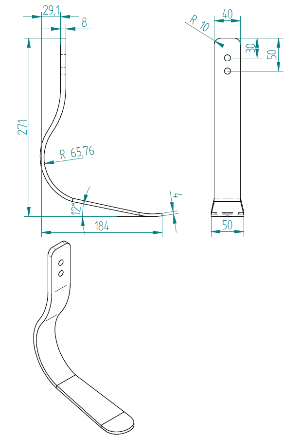
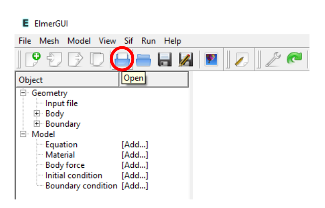
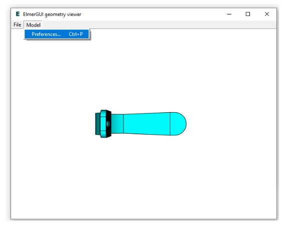
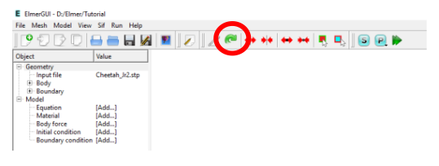
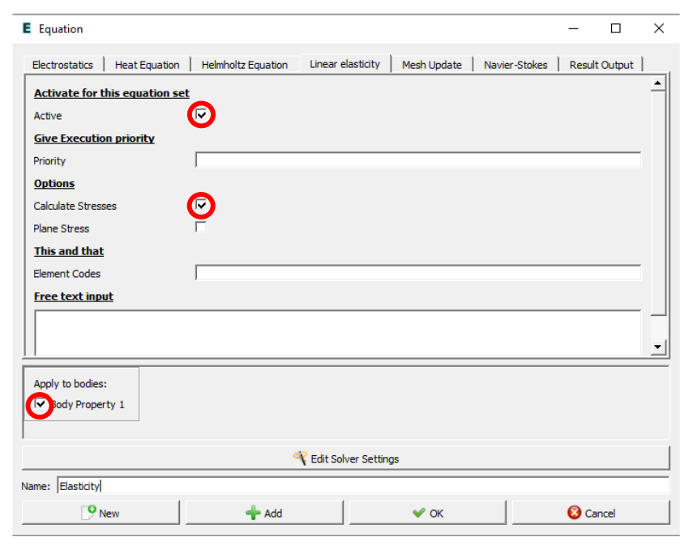
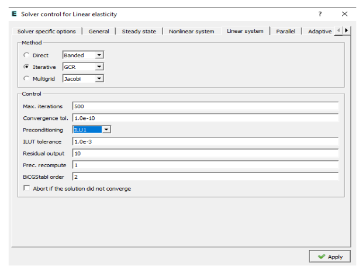
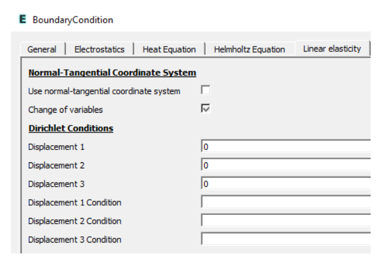
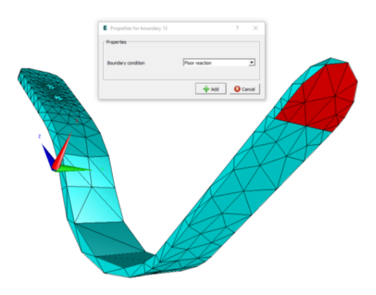
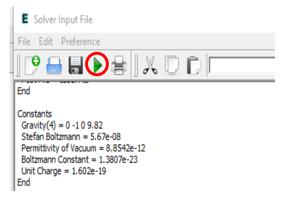

# Simulação Computacional dos Materiais - IFUSP
## Cálculos de elementos finitos utilizando o Elmer

Neste tutorial, vamos aprender a fazer a simulação de uma perna
protética utilizando o método dos elementos finitos (FEM). O arquivo de
entrada que será utilizado nas simulações se encontra no diretório [labFEM1](./)
chamado Cheetah.stp

Iremos utilizar o software [Elmer](http://www.elmerfem.org/blog/), um
programa de código aberto muito bem documentado.

### Ajustes na Máquina Virtual

No terminal, tente abrir o software com o comando **ElmerGUI**. Caso o
sistema acuse a ausência da biblioteca **libQt5Xml.so.5**, favor
re-instalar com o comando:

```bash
sudo apt-get install libqt5xml5
```

### Tutorial -- Perna Protética

1- No terminal, entre na pasta do curso SCM2020 e depois na pasta
LabFEM_1. Ainda no terminal abra o software Elmer com o comando
**ElmerGUI**

**Importando a Geometria (CAD)**

Nesta etapa, iremos importar a geometria da prótese que foi gerada no
software Solid Edge, cujas dimensões são mostradas na figura abaixo.
Nesta etapa, também será realizada a discretização da estrutura.

[](media/image1.png)


2- No Elmer, abra o arquivo Cheetah.stp que se encontra na pasta
LabFEM_1

[](media/image2.png)


3- Clique em Model \> Preferences

[](media/image3.png)


4- Na caixa que abriu, Geometry input preferences, refine a malha
alterando o valor de Max. h para 0.05 ou 0.01, e habilite a caixa
restrict mesh size on surface\...

5- Clique em Apply e feche a caixa ElmerGUI geometry viewer. Agora
clique em remesh para atualizar a malha.

[](media/image4.png)


**Determinando o Modelo Matemático**

6- No Elmer, Clique em Model \> Equation \> add

Nesta etapa, iremos escolher o modelo matemático para realizar nossas
análises, bem como editar configurações do solver.

7- Clique em Linear elasticity e habilite as respectivas opções
destacadas abaixo

8- Dê um nome para a solução

9- Clique em Edit Solver Settings

[](media/image5.png)


10- Clique em Linear system \> Selecione Iterative \> GCR e depois
selecione Preconditioning \> ILU1

[](media/image6.png)


11- Clique em Nonlinear system \> Reduza o número de iterações para 1

12- Clique em Apply

13- Clique em +Add \> e depois em OK

**Propriedades do Material**

Nesta etapa, iremos introduzir as propriedades do material escolhido
para nosso o modelo. Para este projeto em específico vamos inicialmente
fazer um estudo considerando o titânio. Posteriormente consideraremos
uma outra liga chamada Ti-14.8Nb-22Zr, cuja propriedades foram
determinadas pelos pesquisadores no grupo Sampa.

14- Clique em Model \> Material \> Add

15- Digite a densidade do material

-   Para o titânio: 4511 kg/m^3^

-   Para a liga Ti-14.8Nb-22Zr: 6000 kg/m^3^

16- Habilite Body Property 1

17- Dê um nome ao material

18- Clique em Linear elasticity \> Digite as respectivas propriedades do
material

Para o titânio:

-   Módulo de elasticidade (Youngs modulus): 102731879000 Pa

-   Coeficiente de Poisson (Poisson ratio): 0.34

Para a liga Ti-14.8Nb-22Zr:

-   Módulo de elasticidade: 54 GPa (54000000000 Pa)

-   Coeficiente de Poisson: 0.45

19- Clique em +Add e depois em OK

**Condições de Contorno**

20- Ative os eixos de coordenadas em View \> Compass

Esta etapa irá ajudar a determinar a direção do carregamento externo

21- Clique em Model \> Boundary condition \> Add

22- Clique em Linear elasticity

23- Digite as restrições de deslocamento nas direções 1(x), 2(y) e 3(z)

Neste caso, considere zero nas três direções, indicando que alguma parte
da estrutura estará fixa.

[](media/image7.png)

24- Dê um nome para a condição de contorno

25- Clique em +Add e depois em New

Agora, iremos determinar o valor e direção do carregamento.

26- Digite o seguinte valor em Force 3 (direção z)

Nota: o programa indica valores de força quando na verdade são valores
de pressão. No caso deste estudo, entre com o valor de 135469 N/m^2^.
Este valor foi obtido pela aplicação de uma força de 200N na área
vermelha de 1476,35 mm^2^ (valor obtido no software CAD)

[](media/image8.png)

27- Dê um nome para a condição de contorno \> clique em +Add \> OK

Agora as condições definidas acima serão aplicadas na estrutura.

28- Clique em Model \> Set boundary properties

29- Dê 2 cliques na face interna do furo, selecione a condição de
contorno desejada \> +Add

30- Repita o mesmo procedimento para as outras condições de contorno

**Processamento**

Nesta etapa, o arquivo .sif será gerado. Este arquivo contém todos os
dados que serão considerados na simulação.

31- Clique em Sif \> Generate

32- Salve o projeto. File \> Save Project

Agora podemos alterar ou inserir novos dados no arquivo .sif

33- Clique em Sif \> Edit

34- Digite Coordinate scaling = 0.001 no bloco **simulation** do arquivo
.sif

Este comando é utilizado para deixar a escala do modelo compatível com o
sistema SI.

35- Digite Element=p:2 no bloco **solver 1** do arquivo .sif

Este comando é utilizado para aumentar a ordem do elemento de linear
para quadrático

36- Salve o arquivo como case.sif (substitua o já existente)

37- Clique em run \> Start solver para iniciar a simulação

**Pós-Processamento**

38- Após finalizado, clique em Run \> ParaView para visualizar os
resultados

39 - Para fazer novas análises com diferentes parâmetros, clique em Sif
\> Edit\...

Altere os parâmetros de interesse como as propriedades do material ou as
condições de contorno.

40- Salve o arquivo como case.sif (substitua o já existente)

41- Clique em Save and Run para realizar a nova análise

[](media/image9.png)

### Referências e informações adicionais

-   Elmer unofficial home and blog (these pages),
    [www.elmerfem.org](http://www.elmerfem.org/)[/](http://www.elmerfem.org/blog)

-   Elmer FEM discussion forum,
    [www.elmerfem.org/forum](http://www.elmerfem.org/forum)

-   Elmer/ICE community,
    [elmerice.elmerfem.org](http://elmerice.elmerfem.org/)

-   Elmer official homepage,
    [www.csc.fi/elmer](https://www.csc.fi/elmer)

### Agradecimentos

-   A toda comunidade Elmer e a todos envolvidos em seu desenvolvimento
