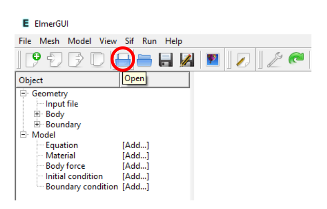
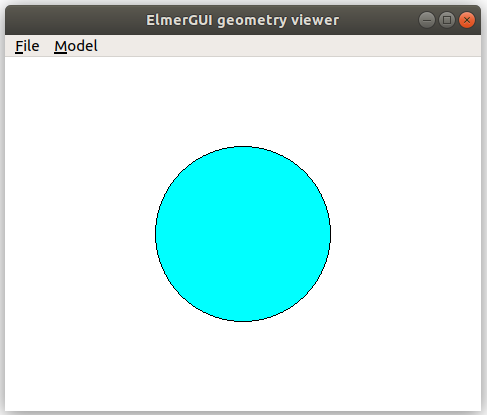
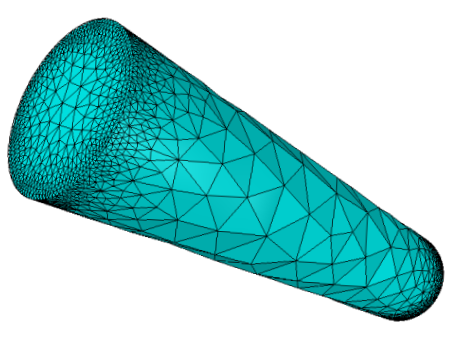
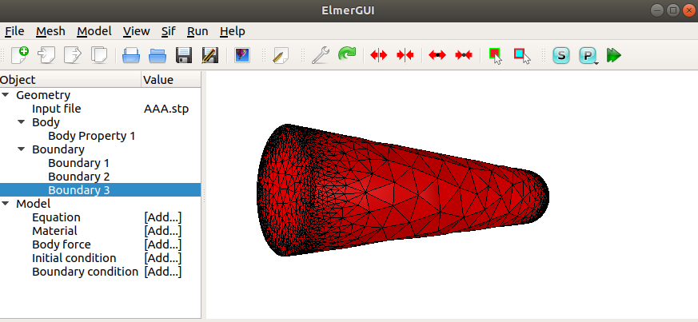
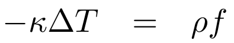
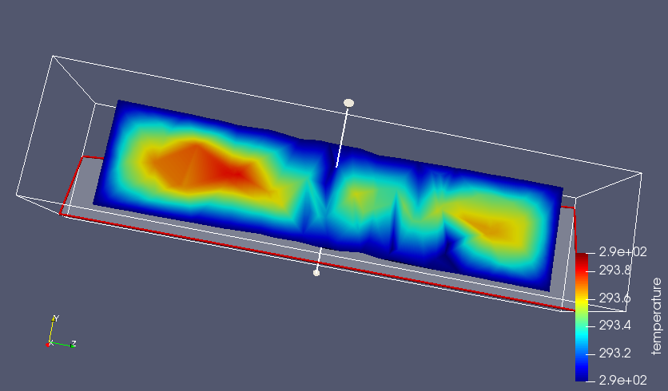

# Simulação Computacional dos Materiais - IFUSP
## Cálculos de elementos finitos utilizando o Elmer, Laboratório 2
Neste tutorial, vamos aprender a fazer a simulação da distribuição de temperatura em uma bateria de Li utilizando o método dos elementos finitos (FEM). O arquivo de entrada que será utilizado nas simulações se encontra no diretório [labFEM2](./) chamado AAA.stp.

Iremos utilizar o software [Elmer](http://www.elmerfem.org/blog/), um programa de código aberto muito bem documentado.
### Ajustes na biblioteca de materiais do Elmer
1. Baixe o arquivo **egmaterials.xml** desta pasta.

2. Desde o terminal substitua esse arquivo na pasta de instalação do Elmer com o seguinte comando
```bash
sudo cp egmaterials.xml /usr/share/ElmerGUI/edf/egmaterials.xml
```
Será necessário fornecer a senha do super usuário.

### Ajustes na Máquina Virtual
No terminal, tente abrir o software com o comando
```bash
ElmerGUI
```
Caso o sistema acuse a ausência da biblioteca **libQt5Xml.so.5**, favor re-instalar com o comando:
```bash
sudo apt-get install libqt5xml5
```
### Tutorial -- Distribuição de temperatura em uma bateria de Li
1- Baixe o arquivo AAA.stp na pasta SCM2020/LabFEM_2.


2- No terminal, entre na pasta do curso SCM2020 e depois na pasta LabFEM_2. Ainda no terminal abra o software Elmer com o comando
```bash
ElmerGUI
```
Nesta etapa, iremos importar a geometria da bateria de Li que foi gerada no software Solid Edge.
Nesta etapa, também será realizada a discretização da estrutura.

[](media/image1.png)


3- No Elmer, abra o arquivo AAA.stp que se encontra na pasta LabFEM_2

[](media/image2_2.png)

O Elmer mostrará o modelo da bateria, porém com uma malha grossa. 

4- Para refinar a malha clique em View \> Cad model

Isso abrirá o visor de geometria (a maior parte das vezes ele já estará aberto)

No visor da geometria clique em:

Model \> Preferences

&nbsp;&nbsp;&nbsp;&nbsp;Restrict mesh size on surfaces by STL density = on

&nbsp;&nbsp;&nbsp;&nbsp;Apply
    
[](media/image3.png)

No ElmerGUI clique em: Mesh \> Remesh

Esse processo pode demorar um pouco.

Logo, obteremos uma malha mais refinada.

[](media/image2.png)

5- Agora precisamos unificar as superfícies para definir as condições de contorno.
Selecione com **clique duplo + Ctrl** as três superfícies.
Logo clique em: Mesh \> Unify Surface

[](media/image4.png)

6- Como estamos interessados no **estado estacionário** da distribuição de temperatura no núcleo de eletricidade da bateria, definiremos esse tipo de simulação. Clique em:

&nbsp;&nbsp;&nbsp;&nbsp;Model

&nbsp;&nbsp;&nbsp;&nbsp;&nbsp;&nbsp;&nbsp;&nbsp;Setup

&nbsp;&nbsp;&nbsp;&nbsp;&nbsp;&nbsp;&nbsp;&nbsp;&nbsp;&nbsp;&nbsp;&nbsp;Simulation Type = Steady state

&nbsp;&nbsp;&nbsp;&nbsp;&nbsp;&nbsp;&nbsp;&nbsp;&nbsp;&nbsp;&nbsp;&nbsp;Steady state max. iter = 1

&nbsp;&nbsp;&nbsp;&nbsp;&nbsp;&nbsp;&nbsp;&nbsp;&nbsp;&nbsp;&nbsp;&nbsp;Apply


7- Na sequência definiremos o **modelo físico** representado pela equação da difusão do calor

[](media/image6.png)

Para isso clique em:

&nbsp;&nbsp;&nbsp;&nbsp;Model

&nbsp;&nbsp;&nbsp;&nbsp;&nbsp;&nbsp;&nbsp;&nbsp;Equation

&nbsp;&nbsp;&nbsp;&nbsp;&nbsp;&nbsp;&nbsp;&nbsp;&nbsp;&nbsp;&nbsp;&nbsp;Add

&nbsp;&nbsp;&nbsp;&nbsp;&nbsp;&nbsp;&nbsp;&nbsp;&nbsp;&nbsp;&nbsp;&nbsp;&nbsp;&nbsp;&nbsp;&nbsp;Name = Heat Equation

&nbsp;&nbsp;&nbsp;&nbsp;&nbsp;&nbsp;&nbsp;&nbsp;&nbsp;&nbsp;&nbsp;&nbsp;&nbsp;&nbsp;&nbsp;&nbsp;Apply to bodies = Body 1

&nbsp;&nbsp;&nbsp;&nbsp;&nbsp;&nbsp;&nbsp;&nbsp;&nbsp;&nbsp;&nbsp;&nbsp;&nbsp;&nbsp;&nbsp;&nbsp;Heat Equation \> Active = on

&nbsp;&nbsp;&nbsp;&nbsp;&nbsp;&nbsp;&nbsp;&nbsp;&nbsp;&nbsp;&nbsp;&nbsp;&nbsp;&nbsp;&nbsp;&nbsp;Add

&nbsp;&nbsp;&nbsp;&nbsp;&nbsp;&nbsp;&nbsp;&nbsp;&nbsp;&nbsp;&nbsp;&nbsp;&nbsp;&nbsp;&nbsp;&nbsp;OK

8- Logo definiremos o **tipo de material** do núcleo de eletricidade da bateria, o Lítio. Clique em:

&nbsp;&nbsp;&nbsp;&nbsp;Model

&nbsp;&nbsp;&nbsp;&nbsp;&nbsp;&nbsp;&nbsp;&nbsp;Material

&nbsp;&nbsp;&nbsp;&nbsp;&nbsp;&nbsp;&nbsp;&nbsp;&nbsp;&nbsp;&nbsp;&nbsp;Add

&nbsp;&nbsp;&nbsp;&nbsp;&nbsp;&nbsp;&nbsp;&nbsp;&nbsp;&nbsp;&nbsp;&nbsp;&nbsp;&nbsp;&nbsp;&nbsp;Material library

&nbsp;&nbsp;&nbsp;&nbsp;&nbsp;&nbsp;&nbsp;&nbsp;&nbsp;&nbsp;&nbsp;&nbsp;&nbsp;&nbsp;&nbsp;&nbsp;&nbsp;&nbsp;&nbsp;&nbsp;Li

&nbsp;&nbsp;&nbsp;&nbsp;&nbsp;&nbsp;&nbsp;&nbsp;&nbsp;&nbsp;&nbsp;&nbsp;&nbsp;&nbsp;&nbsp;&nbsp;&nbsp;&nbsp;&nbsp;&nbsp;OK

&nbsp;&nbsp;&nbsp;&nbsp;&nbsp;&nbsp;&nbsp;&nbsp;&nbsp;&nbsp;&nbsp;&nbsp;&nbsp;&nbsp;&nbsp;&nbsp;Apply to bodies = Body 1

&nbsp;&nbsp;&nbsp;&nbsp;&nbsp;&nbsp;&nbsp;&nbsp;&nbsp;&nbsp;&nbsp;&nbsp;&nbsp;&nbsp;&nbsp;&nbsp;Add

&nbsp;&nbsp;&nbsp;&nbsp;&nbsp;&nbsp;&nbsp;&nbsp;&nbsp;&nbsp;&nbsp;&nbsp;&nbsp;&nbsp;&nbsp;&nbsp;OK

9- O lado direito da equação

[](media/image6.png)

representa a **fonte de calor**. Definiremos essa fonte fazendo clique em:

&nbsp;&nbsp;&nbsp;&nbsp;Model

&nbsp;&nbsp;&nbsp;&nbsp;&nbsp;&nbsp;&nbsp;&nbsp;Body Force

&nbsp;&nbsp;&nbsp;&nbsp;&nbsp;&nbsp;&nbsp;&nbsp;&nbsp;&nbsp;&nbsp;&nbsp;Add

&nbsp;&nbsp;&nbsp;&nbsp;&nbsp;&nbsp;&nbsp;&nbsp;&nbsp;&nbsp;&nbsp;&nbsp;&nbsp;&nbsp;&nbsp;&nbsp;Name = Heating

&nbsp;&nbsp;&nbsp;&nbsp;&nbsp;&nbsp;&nbsp;&nbsp;&nbsp;&nbsp;&nbsp;&nbsp;&nbsp;&nbsp;&nbsp;&nbsp;Heat Equation

&nbsp;&nbsp;&nbsp;&nbsp;&nbsp;&nbsp;&nbsp;&nbsp;&nbsp;&nbsp;&nbsp;&nbsp;&nbsp;&nbsp;&nbsp;&nbsp;Heat Source = 0.01

&nbsp;&nbsp;&nbsp;&nbsp;&nbsp;&nbsp;&nbsp;&nbsp;&nbsp;&nbsp;&nbsp;&nbsp;&nbsp;&nbsp;&nbsp;&nbsp;Apply to bodies = Body 1

&nbsp;&nbsp;&nbsp;&nbsp;&nbsp;&nbsp;&nbsp;&nbsp;&nbsp;&nbsp;&nbsp;&nbsp;&nbsp;&nbsp;&nbsp;&nbsp;Add

&nbsp;&nbsp;&nbsp;&nbsp;&nbsp;&nbsp;&nbsp;&nbsp;&nbsp;&nbsp;&nbsp;&nbsp;&nbsp;&nbsp;&nbsp;&nbsp;OK


10- Agora é momento de definir as **condições de contorno**. Primeiro devemos criar elas fazendo clique em:

&nbsp;&nbsp;&nbsp;&nbsp;Model

&nbsp;&nbsp;&nbsp;&nbsp;&nbsp;&nbsp;&nbsp;&nbsp;BoundaryCondition

&nbsp;&nbsp;&nbsp;&nbsp;&nbsp;&nbsp;&nbsp;&nbsp;&nbsp;&nbsp;&nbsp;&nbsp;Add

&nbsp;&nbsp;&nbsp;&nbsp;&nbsp;&nbsp;&nbsp;&nbsp;&nbsp;&nbsp;&nbsp;&nbsp;&nbsp;&nbsp;&nbsp;&nbsp;Heat Equation

&nbsp;&nbsp;&nbsp;&nbsp;&nbsp;&nbsp;&nbsp;&nbsp;&nbsp;&nbsp;&nbsp;&nbsp;&nbsp;&nbsp;&nbsp;&nbsp;&nbsp;&nbsp;&nbsp;&nbsp;Temperature = 293.0

&nbsp;&nbsp;&nbsp;&nbsp;&nbsp;&nbsp;&nbsp;&nbsp;&nbsp;&nbsp;&nbsp;&nbsp;&nbsp;&nbsp;&nbsp;&nbsp;Name = RoomTemp

&nbsp;&nbsp;&nbsp;&nbsp;&nbsp;&nbsp;&nbsp;&nbsp;&nbsp;&nbsp;&nbsp;&nbsp;&nbsp;&nbsp;&nbsp;&nbsp;Add

&nbsp;&nbsp;&nbsp;&nbsp;&nbsp;&nbsp;&nbsp;&nbsp;&nbsp;&nbsp;&nbsp;&nbsp;&nbsp;&nbsp;&nbsp;&nbsp;OK

11- Agora **aplicaremos as condições de contorno** a nosso modelo. Primeiramente clique em:

&nbsp;&nbsp;&nbsp;&nbsp;Model

&nbsp;&nbsp;&nbsp;&nbsp;&nbsp;&nbsp;&nbsp;&nbsp;Set boundary properties


Para aplicar no modelo faça **clique duplo na superfície** e logo definimos as condições previamente criadas por meio das opções: BoundaryCondition \> RoomTemp \> Add

12- Vamos a gerar o cógido para a simulação (uma espécie de roteiro do Elmer). Clique em Sif \> Generate

Podemos conferir o código por meio das opções Sif \> Edit

13- Ante qualquer eventualidade, é recomdável salvar o projeto em uma pasta. Clique em File \> Save Project, e a continuação crie uma pasta para salvar o seu projeto.

14- Finalmente podemos rodar a simulação com a opção Run \> Start solver

Caso a simulação tenha rodao sem nenhum problema, nas últims linhas aparecerá a seguinte mensagem **Elmer Solver: ALL DONE**

15- Para visualizar os resultados utilizaremos o **Paraview**. Podemos abrir ele por meio das opções Run \> Paraview
A interfaz gráfica do Paraview apresentará algo parecido com a seguinte imagem 

[](media/image5.png)


### Referências e informações adicionais


    © 2020 GitHub, Inc.
    Terms
    Privacy
    Security
    Status
    Help
    Contact GitHub
    Pricing
    API
    Training
    Blog
    About
