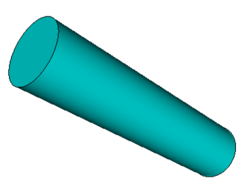

# Simulação Computacional dos Materiais - IFUSP
## Cálculos de elementos finitos utilizando o Elmer, Laboratório 2
Neste tutorial, vamos aprender a fazer a simulação da distribuição de temperatura em uma bateria de Li utilizando o método dos elementos finitos (FEM). O arquivo de entrada que será utilizado nas simulações se encontra no diretório [labFEM2](./) chamado AAA.stp
Iremos utilizar o software [Elmer](http://www.elmerfem.org/blog/), um programa de código aberto muito bem documentado.
### Ajustes na Máquina Virtual
No terminal, tente abrir o software com o comando **ElmerGUI**. Caso o sistema acuse a ausência da biblioteca **libQt5Xml.so.5**, favor re-instalar com o comando:
```bash
sudo apt-get install libqt5xml5
```
### Tutorial -- Distribuição de temperatura em uma bateria de Li
1- No terminal, entre na pasta do curso SCM2020 e depois na pasta LabFEM_2. Ainda no terminal abra o software Elmer com o comando
**ElmerGUI**
**Importando a Geometria (CAD)**
Nesta etapa, iremos importar a geometria da prótese que foi gerada no software Solid Edge.
Nesta etapa, também será realizada a discretização da estrutura.

[](media/image1.png)


2- No Elmer, abra o arquivo AAA.stp que se encontra na pasta LabFEM_2

[](media/image2_2.png)

O ELmer mostrará o modelo da bateria, porém com uma malha grossa. 

3- Para refinar a malha clique em View \> Cad model

Isso abrirá o visor de geometria (a maior parte das vezes ele já estará aberto)

No visor da geometria clique em:

Model \> Preferences

&nbsp;&nbsp;&nbsp;&nbsp;Restrict mesh size on surfaces by STL density = on

&nbsp;&nbsp;&nbsp;&nbsp;Apply
    
[](media/image3.png)

No ElmerGUI clique em: Mesh \> Remesh

Obterá uma malha mais refinada.

[](media/image2.png)

4- Agora precisamos unificar as superfícies para definir as condições de contorno.
Selecionar com clique duplo + Ctrl as três superfícies.
Logo clique em: Mesh \> Unify Surface

[](media/image4.png)

5- Difiniremos o tipo de simulação (estado estacionário). Clique em:

&nbsp;&nbsp;&nbsp;&nbsp;Model

&nbsp;&nbsp;&nbsp;&nbsp;&nbsp;&nbsp;&nbsp;&nbsp;Setup

&nbsp;&nbsp;&nbsp;&nbsp;&nbsp;&nbsp;&nbsp;&nbsp;&nbsp;&nbsp;&nbsp;&nbsp;Simulation Type = Steady state

&nbsp;&nbsp;&nbsp;&nbsp;&nbsp;&nbsp;&nbsp;&nbsp;&nbsp;&nbsp;&nbsp;&nbsp;Steady state max. iter = 1

&nbsp;&nbsp;&nbsp;&nbsp;&nbsp;&nbsp;&nbsp;&nbsp;&nbsp;&nbsp;&nbsp;&nbsp;Apply


6- Definiremos o modelo físico por meio da eleição do tipo de equação. Clique em:

&nbsp;&nbsp;&nbsp;&nbsp;Model

&nbsp;&nbsp;&nbsp;&nbsp;&nbsp;&nbsp;&nbsp;&nbsp;Equation

&nbsp;&nbsp;&nbsp;&nbsp;&nbsp;&nbsp;&nbsp;&nbsp;&nbsp;&nbsp;&nbsp;&nbsp;Add

&nbsp;&nbsp;&nbsp;&nbsp;&nbsp;&nbsp;&nbsp;&nbsp;&nbsp;&nbsp;&nbsp;&nbsp;&nbsp;&nbsp;&nbsp;&nbsp;Name = Heat Equation

&nbsp;&nbsp;&nbsp;&nbsp;&nbsp;&nbsp;&nbsp;&nbsp;&nbsp;&nbsp;&nbsp;&nbsp;&nbsp;&nbsp;&nbsp;&nbsp;Apply to bodies = Body 1

&nbsp;&nbsp;&nbsp;&nbsp;&nbsp;&nbsp;&nbsp;&nbsp;&nbsp;&nbsp;&nbsp;&nbsp;&nbsp;&nbsp;&nbsp;&nbsp;Heat Equation \> Active = on

&nbsp;&nbsp;&nbsp;&nbsp;&nbsp;&nbsp;&nbsp;&nbsp;&nbsp;&nbsp;&nbsp;&nbsp;&nbsp;&nbsp;&nbsp;&nbsp;Add

&nbsp;&nbsp;&nbsp;&nbsp;&nbsp;&nbsp;&nbsp;&nbsp;&nbsp;&nbsp;&nbsp;&nbsp;&nbsp;&nbsp;&nbsp;&nbsp;OK

7- . Clique em:

&nbsp;&nbsp;&nbsp;&nbsp;Model

&nbsp;&nbsp;&nbsp;&nbsp;&nbsp;&nbsp;&nbsp;&nbsp;Material

&nbsp;&nbsp;&nbsp;&nbsp;&nbsp;&nbsp;&nbsp;&nbsp;&nbsp;&nbsp;&nbsp;&nbsp;Add

&nbsp;&nbsp;&nbsp;&nbsp;&nbsp;&nbsp;&nbsp;&nbsp;&nbsp;&nbsp;&nbsp;&nbsp;&nbsp;&nbsp;&nbsp;&nbsp;Material library

&nbsp;&nbsp;&nbsp;&nbsp;&nbsp;&nbsp;&nbsp;&nbsp;&nbsp;&nbsp;&nbsp;&nbsp;&nbsp;&nbsp;&nbsp;&nbsp;&nbsp;&nbsp;&nbsp;&nbsp;Li

&nbsp;&nbsp;&nbsp;&nbsp;&nbsp;&nbsp;&nbsp;&nbsp;&nbsp;&nbsp;&nbsp;&nbsp;&nbsp;&nbsp;&nbsp;&nbsp;Apply to bodies = Body 1

&nbsp;&nbsp;&nbsp;&nbsp;&nbsp;&nbsp;&nbsp;&nbsp;&nbsp;&nbsp;&nbsp;&nbsp;&nbsp;&nbsp;&nbsp;&nbsp;Add

&nbsp;&nbsp;&nbsp;&nbsp;&nbsp;&nbsp;&nbsp;&nbsp;&nbsp;&nbsp;&nbsp;&nbsp;&nbsp;&nbsp;&nbsp;&nbsp;OK

8- Definiremos a fonte de calor. Clique em:

&nbsp;&nbsp;&nbsp;&nbsp;Model

&nbsp;&nbsp;&nbsp;&nbsp;&nbsp;&nbsp;&nbsp;&nbsp;Body Force

&nbsp;&nbsp;&nbsp;&nbsp;&nbsp;&nbsp;&nbsp;&nbsp;&nbsp;&nbsp;&nbsp;&nbsp;Add

&nbsp;&nbsp;&nbsp;&nbsp;&nbsp;&nbsp;&nbsp;&nbsp;&nbsp;&nbsp;&nbsp;&nbsp;&nbsp;&nbsp;&nbsp;&nbsp;Name = Heating

&nbsp;&nbsp;&nbsp;&nbsp;&nbsp;&nbsp;&nbsp;&nbsp;&nbsp;&nbsp;&nbsp;&nbsp;&nbsp;&nbsp;&nbsp;&nbsp;Heat Source = 0.01

&nbsp;&nbsp;&nbsp;&nbsp;&nbsp;&nbsp;&nbsp;&nbsp;&nbsp;&nbsp;&nbsp;&nbsp;&nbsp;&nbsp;&nbsp;&nbsp;Apply to bodies = Body 1

&nbsp;&nbsp;&nbsp;&nbsp;&nbsp;&nbsp;&nbsp;&nbsp;&nbsp;&nbsp;&nbsp;&nbsp;&nbsp;&nbsp;&nbsp;&nbsp;Add

&nbsp;&nbsp;&nbsp;&nbsp;&nbsp;&nbsp;&nbsp;&nbsp;&nbsp;&nbsp;&nbsp;&nbsp;&nbsp;&nbsp;&nbsp;&nbsp;OK


9- Definiremos as condições de contorno. Primeiro criaremos elas. Clique em:

&nbsp;&nbsp;&nbsp;&nbsp;Model

&nbsp;&nbsp;&nbsp;&nbsp;&nbsp;&nbsp;&nbsp;&nbsp;BoundaryCondition

&nbsp;&nbsp;&nbsp;&nbsp;&nbsp;&nbsp;&nbsp;&nbsp;&nbsp;&nbsp;&nbsp;&nbsp;Add

&nbsp;&nbsp;&nbsp;&nbsp;&nbsp;&nbsp;&nbsp;&nbsp;&nbsp;&nbsp;&nbsp;&nbsp;&nbsp;&nbsp;&nbsp;&nbsp;Heat Equation

&nbsp;&nbsp;&nbsp;&nbsp;&nbsp;&nbsp;&nbsp;&nbsp;&nbsp;&nbsp;&nbsp;&nbsp;&nbsp;&nbsp;&nbsp;&nbsp;&nbsp;&nbsp;&nbsp;&nbsp;Temperature = 293.0

&nbsp;&nbsp;&nbsp;&nbsp;&nbsp;&nbsp;&nbsp;&nbsp;&nbsp;&nbsp;&nbsp;&nbsp;&nbsp;&nbsp;&nbsp;&nbsp;Name = RoomTemp

&nbsp;&nbsp;&nbsp;&nbsp;&nbsp;&nbsp;&nbsp;&nbsp;&nbsp;&nbsp;&nbsp;&nbsp;&nbsp;&nbsp;&nbsp;&nbsp;Add

&nbsp;&nbsp;&nbsp;&nbsp;&nbsp;&nbsp;&nbsp;&nbsp;&nbsp;&nbsp;&nbsp;&nbsp;&nbsp;&nbsp;&nbsp;&nbsp;OK

10- Agora aplicaremos as condições de contorno a nosso modelo. Primeiramente clique em:

&nbsp;&nbsp;&nbsp;&nbsp;Model

&nbsp;&nbsp;&nbsp;&nbsp;&nbsp;&nbsp;&nbsp;&nbsp;Set boundary properties


Para aplicar no modelo clique na superfície e logo BoundaryCondition \> RoomTemp

11- Vamos a gerar o cógido para a simulação (uma espécie de roteiro do Elmer). Clique em Sif \> Generate

Podemos conferir o código por meio de Sif \> Edit \> look how your command file came out

12- Ante qualquer eventualidade é recomdável salvar numa pasta o nosso projeto. Clique em File \> Save Project

13- Finalmente podemos rodar a simulação com a opção do menu Run \> Start solver

14- Podemos visualizar os resultados por meio das opções Run \> Paraview

[](media/image5.png)


### Referências e informações adicionais


    © 2020 GitHub, Inc.
    Terms
    Privacy
    Security
    Status
    Help
    Contact GitHub
    Pricing
    API
    Training
    Blog
    About
