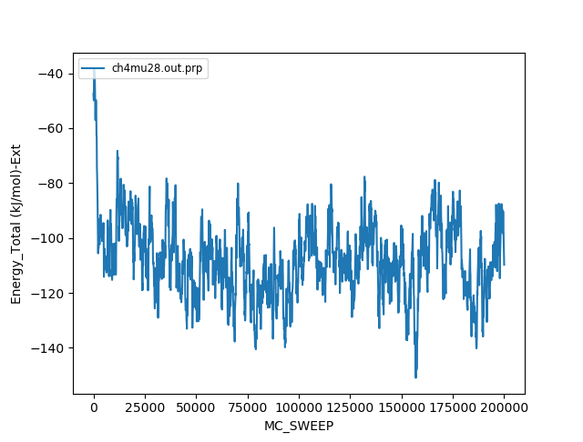
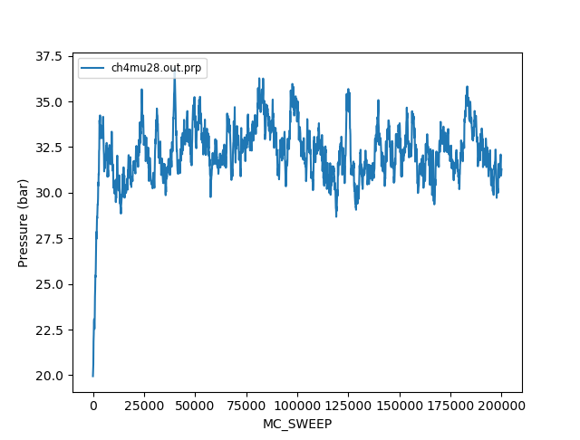
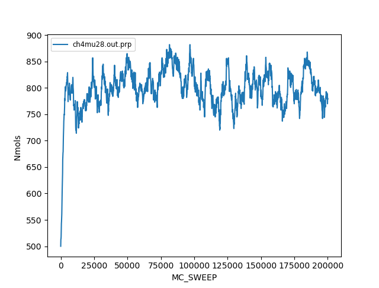
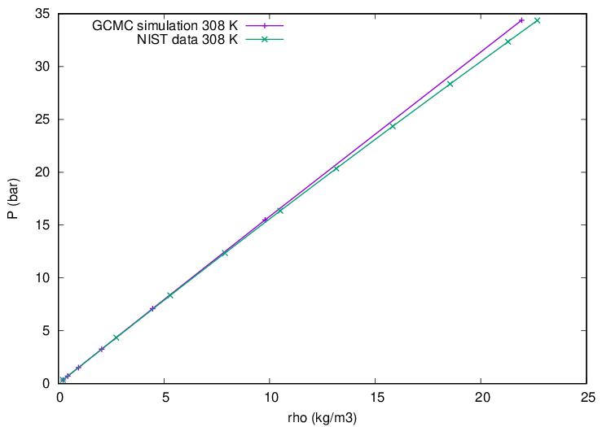
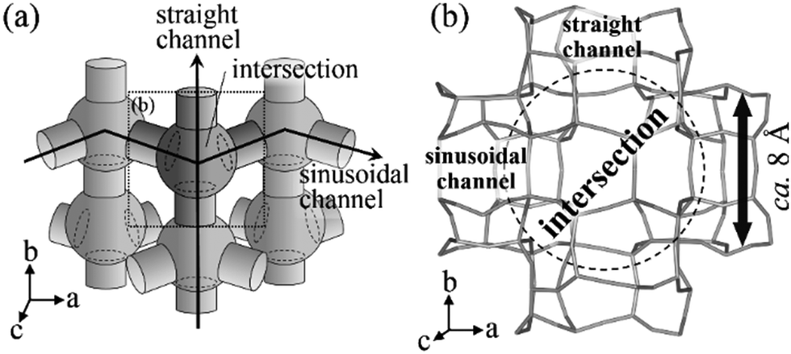
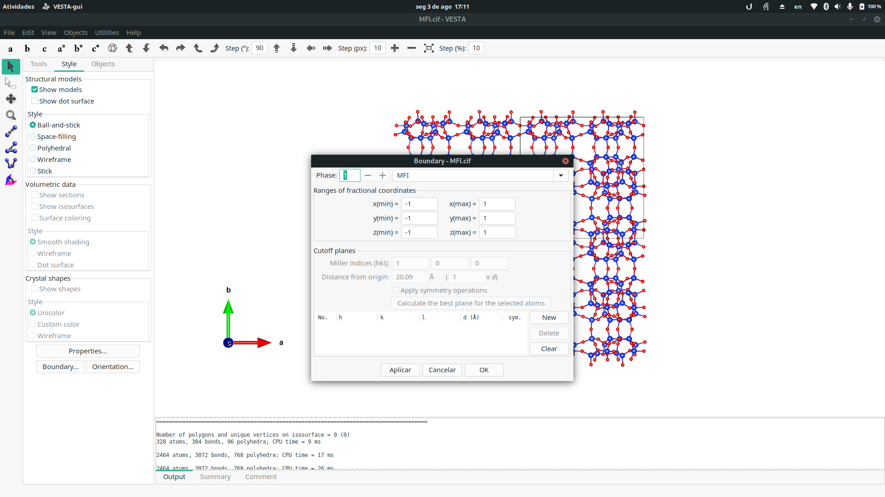
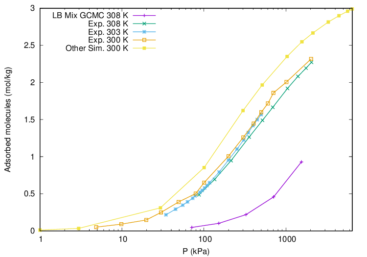
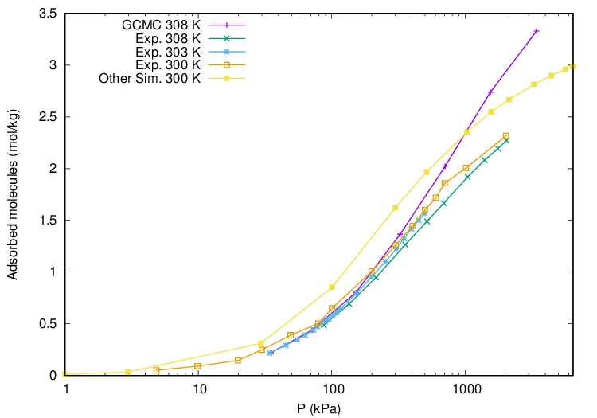

# Simulações gás-sólido com Grand-Canonical Monte Carlo

Uma das aplicações mais importantes de métodos de Monte Carlo é para a simulações em condições termodinâmicas de alta temperatura e pressão.
Nessas condições, o uso da dinâmica molecular é dificultado pela dificuldade em convergir em alguns casos, e também pela dependência de termostatos e barostatos para simular o ensemble desejado.
Além disso, com Monte Carlo a utilização de ensembles abertos (onde `N` varia) é feita de maneira trivial.
Desses ensembles, dois são de extrema importância:

 - O ensemble grande-canônico, onde o potencial químico , o volume *V* e a temperatura *T* são mantidas constantes
 - O ensemble de Gibbs, utilizado para simular a coexistência gás-líquido

Neste tutorial, vamos aprender a fazer a simulação de sistemas gás-sólido utilizando o Gran-Canonical Monte Carlo (GCMC).
Mais especificamente, iremos estudar a adsorção de gases em sistemas porosos, no caso, em uma zeólita.
Esse tipo de simulação é de grande importância tanto em pesquisa básica quanto para aplicações industriais.

Iremos utilizar o software [Cassandra](http://cassandra.nd.edu/) um programa de código aberto capaz de realizar simulações de Monte Carlo de sistemas moleculares.

## Objetivos

Temos como objetivo principal, obter a curva da isoterma de adsorção de metano na silicalita (zeólita com estrutura de poros do tipo MFI).
Essa curva é conhecida na literatura, e já foi obtida tanto experimentalmente quanto utilizando diferentes potenciais e métodos de GCMC.

## Resumo da teoria

Nas simulações moleculares com Monte Carlo, propomos novas configurações (novos pontos no espaço de fase) de maneira aleatória e aceitamos, ou rejeitamos, as novas configurações baseada em um critério de aceitação.
O critério de aceitação é construído de modo que as configurações amostradas reflitam a distribuição de equlíbrio do ensemble termodinâmico desejado.
Dessa maneira, é possível calcular propriedades como energia, calor específico e função distribuição radial das configurações amostradas, e fazendo uma média, obter os valores médios nas condições termodinâmicas de interesse.

Neste tutorial usaremos o ensemble grand-canônico para realizar uma simulação onde , *V* e *T* são mantidas constantes, e outras grandezas como a pressão ou número de partículas podem variar.
Esse tipo de simulação é útil especialmente para se obter isotermas de adsorção, e estudar como em uma dada temperatura, as moléculas de um gás ou líquido são distribuídas de acordo com o potencial químico.
O potencial químico está relacionado a afinidade do reservatório com as partículas.
Na prática, realizar simulações em diferentes potenciais químicos significa realizar simulações em pressões diferentes, já que mais ou menos moléculas vão ocupar um volume de acordo com o potencial químico.

Na simulação com Grand-Canonical Monte Carlo (GCMC) existem 4 tipos de movimento que podem ser feitos para criar uma nova configuração baseada na configuração anterior: i) translação; ii) rotação; iii) inserção e; iv) remoção.
A cada passo de Monte Carlo, um desses quatro tipos de movimento é selecionado aleatoriamente (com probabilidade definida pelo usuário) e após a modificação da configuração com o movimento, a energia potencial da nova configuração é calculada e comparada com a energia potencial da configuração antiga usando o critério de aceitação.
Para os movimentos de translação e rotação, uma molécula da caixa é selecionada aleatoriamente, o movimento é aplicado e então a nova configuração pode ou não ser aceita de acordo com o critério de Metropolis:


sendo U<sub>n</sub> a energia potencial da configuração nova `n`.
Veja que se a energia potencial da configuração nova é menor que a da configuração antiga, a nova configuração e aceita, se não, existe uma probabilidade de ela ser aceita de acordo com o valor de `acc`.

Para os movimentos de inserção e remoção de moléculas, um critério de aceitação diferente é utilizado.
No movimento de inserção, `kappa_ins` possíveis posições de inserção da molécula na caixa são geradas aleatoriamente.
Uma dessas posições é selecionada com uma probabilidade baseada na energia de inserção em cada uma das posições, o que junto com outras probabilidades de seleção (como, por exemplo, a de selecionar aquele tipo de molécula para inserir) da origem a um termo de probabilidade P<sub>mn</sub><sup>bias</sup>.
Sendo  um potencial químico efetivo, que além de conter o potencial químico inclui algumas constantes, temos que essa nova configuração com a molécula inserida é aceita ou rejeitada baseada no critério:


com N<sub>m</sub> sendo o número de moléculas na caixa na configuração `m`, e  o comprimento de onda de de Broglie da molécula.
A remoção de uma molécula ocorre de maneira similar, para assim poder amostrar da distribuição de equilíbrio, e a remoção é aceita ou rejeitada baseada no critério de aceitação:


Mais detalhes sobre o método GCMC podem ser vistos no livro: *Frenkel, D., Smit, B. (2002). Understanding Molecular Simulation: From Algorithms to Applications. San Diego: Academic Press*. 
Detalhes sobre a implementação podem ser vistos no [artigo](http://doi.wiley.com/10.1002/jcc.24807) ou [manual](docs/Cassandra_user_guide_1.2.pdf) do Cassandra.

## Potencial químico para a simulação

Cada aluno irá simular com um potencial químico diferente (cada valor de potencial químico está associado a uma pressão).
Ao final, teremos dados em 22 pressões diferentes, que poderão ser utilizados para obter a isoterma de adsorção de metano na silicalita.
Veja o potencial químico que utilizará nas suas simulações na tabela abaixo:

Aluno | Potencial químico | Aluno | Potencial químico
----- | ----------------- | ----- | -----------------
1     | -28.0             | 12    | -37.0
2     | -29.0             | 13    | -37.5
3     | -30.0             | 14    | -38.0
4     | -31.0             | 15    | -38.5
5     | -32.0             | 16    | -39.0
6     | -33.0             | 17    | -39.5
7     | -34.0             | 18    | -40.0
8     | -35.0             | 19    | -40.5
9     | -35.5             | 20    | -41.0
10    | -36.0             | 21    | -42.0
11    | -36.5             | 22    | -43.0

Note que o potencial químico indicado na tabela não é o potencial químico real, pois o Cassandra utiliza um potencial químico deslocado.
Isso não muda nada em termos práticos para a simulação, mas pode alterar a comparação de dados com a literatura (se estiver comparando resultados por potencial químico, e não pressão).

## Simulação de metano em fase gasosa

Antes de fazer a simulação da adsorção de metano na zeólita, vamos fazer a simulação de metano puro na fase gasosa.
Essa simulação será importante pois nos permitirá obter a relação entre potencial químico e pressão, que será utilizada posteriormente para definir a pressão das simulações com a silicalita.
Utilizaremos um modelo *united atom* para o metano, o que significa que a molécula será constituída de um único átomo do tipo `CH4`, que é equivalente a molécula CH<sub>4</sub>.

O Cassandra se utiliza de arquivos do tipo `pdb`.
Arquivos `pdb` são utilizados para armazenar diversas informações estruturais, e tem um formato complexo e fixo.
Normalmente esses arquivos são criados com o auxílio de algum software onde o usuário desenha a molécula como, por exemplo, o Avogadro.
No nosso caso temos uma molécula extremamente simples, então o arquivo pode ser gerado manualmente.
Crie um arquivo `CH4.pdb` com o conteúdo:

```
COMPND    UA methane 
HETATM    1  C   UNM     1       0.000   0.000   0.000  1.00  0.00         CH4  
END
```

Agora iremos criar o arquivo `mcf`, que contém a topologia da molécula estudada.
Esse arquivo pode ser criado com o auxílio da ferramenta `mcfgen.py` que acompanha o Cassandra (com a opção `--ffTemplate`).
```
python2 ~/Softwares/Cassandra/Cassandra_V1.2/Scripts/MCF_Generation/mcfgen.py CH4.pdb --ffTemplate
```
Quando perguntado sobre o tipo de potencial de van der Waals (VDW), responda `LJ`.
Esse comando irá criar o arquivo `CH4.ff` que é um arquivo intermediário gerado para facilitar a criação do `mcf`.
Nele, preenchemos os parâmetros  e  de cada átomo da molécula.
Esses parâmetros são referentes a expressão da energia potencial de interação de Lennard-Jones:


Onde o termo elevado a 12 dá a parte repulsiva e o termo elevado a 6 dá a parte atrativa do potencial.
Os indíces `ij` são referentes aos átomos das moléculas.
Nesse caso, utilizamos os parâmetros referente ao átomo do tipo `CH4`.
Localize no arquivo o átomo do tipo CH4 e edite os parâmetros manualmente:

```
nonbonded
CH4
Sigma 2.73 
Epsilon 148.0
atom_type_charge 0.0 
```

Após isso, execute novamente o `mcfgen.py` agora para criar o `mcf`.
```
python2 ~/Softwares/Cassandra/Cassandra_V1.2/Scripts/MCF_Generation/mcfgen.py CH4.pdb
``` 
Com isso, temos o arquivo `CH4.mcf`.
Visualize esse arquivo e tente entender o seu conteúdo.

Os parâmetros de controle da simulação são armazenados em um único arquivo.
Nomearemos esse arquivo `gcmc.inp`, e ele terá como conteúdo:
```
! This is the input file for a GCMC short simulation of CH4 in gas phase

# Run_Name
ch4mu38p5.out
!------------------------------------------------------------------------------

# Sim_Type
GCMC
!------------------------------------------------------------------------------

# Nbr_Species
1
!------------------------------------------------------------------------------

# VDW_Style
LJ cut_tail 50.0
!------------------------------------------------------------------------------

# Charge_Style
NONE
!----------------------------------------"NONE" or "Coul Ewald cutoff accuracy"

# Intra_Scaling
0.0 0.0 0.0 0.0
!----------------------------------------------vdw, coul lines for each species

# Mixing_Rule
LB
!---------------------------------------------------------------LB or geometric

# Seed_Info
58092774 287116403
!------------------------------------------------------------------------------

# Pair_Energy
true
!------------------------------------------------------------------------------

# Rcutoff_Low
1.0
!----------------------------------------------------------------------Angstrom

# Molecule_Files
CH4.mcf  300
!----------------------------------------------------------one line per species

# Box_Info
1
CUBIC
100.0
!-------------------------------------------------------line 1: number of boxes
!--------------------------------------------------------------line 2: box type
!-------------------------------------------------line 3: box size in Angstroms

# Temperature_Info
308.
!------------------------------------------------------------------------Kelvin

# Chemical_Potential_Info
-38.5
!------------------------------------------------------------------------kJ/mol

# Move_Probability_Info

# Prob_Translation
0.34
14.0

# Prob_Insertion
0.33
cbmc

# Prob_Deletion
0.33

# Done_Probability_Info
!---------------------one line for each box and one entry/line for each species

# Start_Type
make_config 30
!------------------------------------------------------------------------------

# Run_Type
Equilibration   1000
!------------------------Equilibration: update maximum widths every 1000 sweeps
!---------------------------Production: report success ratio for each move type

# Average_Info
1
!------------------------------------------------------------ 0 == yes, 1 == no

# Simulation_Length_Info
Units        Steps
Prop_Freq    100
Coord_Freq   100
Run          200000
!----------------------------------- output every 100 sweeps; run 200000 sweeps

# Property_Info 1
Energy_Total
Pressure
Nmols
Density
!------------------------------------------------------------------------------

# Fragment_Files
!---------------------------------------------------------one line per fragment

# CBMC_Info
kappa_ins 12
kappa_rot 0
kappa_dih 12
rcut_cbmc 6.5
!------------------------------------------------------------------------------

END
```
Detalhes sobre cada um dos comandos podem ser vistos no [manual do Cassandra](docs/Cassandra_user_guide_1.2.pdf).
Basicamente, o arquivo contém informações sobre a caixa de simulação, como tamanho, número de moléculas, temperatura, e tipo de simulação.
Nesse caso, iniciamos com uma caixa com 30 moléculas de metano (dado pelo comando `make_config`) e simulamos com o GCMC a uma temperatura de 308 K (dado pelo `Temperature_Info`) por 200000 passos de Monte Carlo (dado pelo `Run` no `Simulation_Length_Info`).
Escolhemos essa temperatura pois existem dados experimentais na literatura para a isoterma de adsorção de metano na silicalita, e podemos comparar os resultados ao final do tutorial.

Além disso, é nesse arquivo que temos especificar parâmetros de simulação e as propriedades de saída desejadas.
Um dos parâmetros especificados é o título da simulação (altere como desejar) e a semente utilizada pelo gerador de números aleatórios `Seed_Info`.
Altere a semente utilizando dois números inteiros diferentes para fazer com que a sua simulação utilize números aleatórios diferente de seus colegas.

Criaremos agora os fragmentos à partir dessa molécula.
Fragmentos, como o nome já sugere, dividem a molécula em pedaços, onde as divisões são feitas em partes geralmente flexíveis da molécula.
Por possuir somente um átomo efetivo, a molécula irá possuir apenas um fragmento.
Moléculas mais complexas (se estivéssemos inserindo butano, por exemplo) são inseridas na caixa passo a passo, e por isso os fragmentos são necessários dentro do algoritmo de Configurational Bias Monte Carlo.
De qualquer maneira, podemos gerar os fragmentos executando a ferramenta `library_setup.py` que acompanha o Cassandra.
```
python2 ~/Softwares/Cassandra/Cassandra_V1.2/Scripts/Frag_Library_Setup/library_setup.py ~/Softwares/Cassandra/Cassandra_V1.2/Src/cassandra_intel_openMP.exe gcmc.inp CH4.pdb
```
Esse comando irá modificar o arquivo `gcmc.inp` e criar o diretório `species1` que contém os arquivo de fragmentos.
Verifique o que foi alterado na seção `Fragment_Files` do arquivo.

Vamos agora criar um diretório e executar a simulação em um potencial químico específico.
```
mkdir 38.5
cp -R species1/ 38.5
cp gcmc.inp 38.5
cp CH4.mcf 38.5
```
Contudo, mude o valor 38.5 para o valor do potencial químico que irá simular.
Edite o arquivo `gcmc.inp` do diretório em que copiou alterando o `# Chemical_Potential_Info` para o valor desejado (no exemplo acima, -38.5).

Antes de executar o Cassandra, definimos a variável de ambiente `OMP_NUM_THREADS`, que determinar o número de *threads* a serem utilizadas na execução paralela.
Por estamos executando um sistema de pouquíssimos átomos, utilizar 2 threads é o suficiente:
```
export OMP_NUM_THREADS=2
```
Para executar o Cassandra, use o comando
```
nohup ~/Softwares/Cassandra/Cassandra_V1.2/Src/cassandra_intel_openMP.exe gcmc.inp > gcmc.out &
```
A simulação executa em 2-5 minutos (com 2 threads, a depender do número médio de moléculas).

Seguindo esses passos para diferentes potenciais químicos, obtemos a relação de potencial químico e pressão.
Primeiro, verificamos que vamos extrair as propriedades de uma simulação convergida, que amostrou configurações em torno do equilíbrio.
Verificamos isso olhando para a energia, pressão e número de moléculas (e em simulações onde o volume não é constante, o volume).
Essa informação está contida no arquivo `prp`, que pode ser inspecionado manualmente, com um editor de texto (como o `gedit`), ou ainda graficamente com o auxílio de um dos scripts distribuído com o Cassandra:

```
python2 ~/Softwares/Cassandra/Cassandra_V1.2/Scripts/Post_Analysis/plot.py ch4mu28.out.prp
```

Ao executar o comando acima, você pode selecionar a propriedade a ser graficada inserindo o número indicado e pressionando `Enter`.
Por exemplo, o gráfico da energia deve ser parecido com o abaixo: 



Note que inicialmente, a energia está próxima de -40 kJ/mol, e com o passos dos passos de MC a energia vai caindo, ficando oscilando em torno de -110 kJ/mol no fim da simulação.
Esse tipo de comportamento indica que a energia foi "termalizada".
Para sabermos se a termalização foi concluída, temos que executar uma simulação com um número razoável de passos e observar que, não somente a energia, mas também outras propriedades se mantém oscilando em torno de um valor médio.
Vamos olhar agora para a pressão:



E para o número de moléculas:



Vemos que de maneira similar a energia, a pressão e número de moléculas também oscilam em torno de um valor médio nos passos finais da simulação.
Isso indica que a termalização foi concluída.
Deveríamos então executar uma nova simulação, partindo da configuração final da termalização, chamada de "simulação de produção".
A simulação de produção tem tipicamente mais passos que a simulação de termalização, e é da simulação de produção que tiramos os valores médios das propriedades de interesse.

Contudo, para avançarmos mais rapidamente com esse tutorial, e considerando que são necessários poucos passos até a simulação começar a oscilar em torno das médias nesse sistema, usaremos os valores médios da simulação de termalização.
Os valores médios podem ser obtidos com o mesmo *script* que faz o gráficos dos dados.
Para descartar os primeiros 200 pontos (onde as propriedades ainda não convergiram para a média) usaremos a opção `-skip 200` na linha de comando:

```
python2 ~/Softwares/Cassandra/Cassandra_V1.2/Scripts/Post_Analysis/plot.py ch4mu28.out.prp -skip 200
```

Ao executar o script e selecionar propriedade, observe o valor médio dado (e a unidade):
```
Output: Pressure (bar) 

**************************************************

      File Name         Average        Std Dev.
**************************************************

ch4mu28.out.prp      32.3855918       0.3651656

```

Anote esse valor, pois utilizaremos o valor médio da pressão da simulação do metano em fase gasosa na simulação da adsorção de metano na silicalita.
Considerando as simulações feitas nos diferentes potenciais químicos, podemos fazer a curva de pressão por densidade.
Podemos pegar os dados da pressão média e densidade usando o método acima (e considerando o peso molecular do metano de 0.01604 kg/mol) levantar a curva densidade por pressão (como na figura abaixo).
Para isso, adicione os valores de pressão e densidade relativos ao potencial químico que simulou na [**PLANILHA DO TUTORIAL**](https://docs.google.com/spreadsheets/d/1X2Xy7CRzym9jnWCmL4UMnxemVm_gDE7aG2BNmNT9slM/edit?usp=sharing).



Na figura acima, comparamos com os dados do [NIST](https://webbook.nist.gov/cgi/fluid.cgi?ID=C74828&Action=Page), que são dados obtidos do ajuste de uma equação de estado a dados experimentais.
Vemos um excelente acordo entre a simulação e o experimento, com pequenos desvios apenas para altas pressões.

Com isso, validamos nosso modelo de gás e podemos avançar e fazer as simulações com a zeólita.
Utilizaremos os mesmo potenciais químicos utilizados para a simulação em gás, pois queremos obter a relação do número de moléculas adsorvidas em função da pressão nessa temperatura.

## Preparando a estrutura da zeólita

Para o tutorial utilizaremos a silicalita.
A silicalita é uma zeólita com estrutura de poros e canais do tipo MFI, onde existem dois tipos de canais: um canal reto e outro em zig zag, também chamado de sinusoidal.



Existem bases de dados com zeólitas de diferentes tipos de poros e canais, como é o caso da [IZA-SC](https://europe.iza-structure.org/IZA-SC/ftc_table.php).
Entre no site, clique em MFI para ver a estrutura da zeólita.
Na barra superior vá em `CIF > MFI Framework` e faça o download da estrutura no formato `cif`.

Vamos agora criar a estrutura sólida da silicalita para a simulação.
Utilizaremos o software [VESTA](https://jp-minerals.org/vesta/en/download.html) que está instalado na sua máquina virtual.
Abra a estrutura baixada no VESTA:
```
VESTA MFI.cif
```

Iremos criar uma supercélula 2x2x2 (para comportar mais moléculas de metano) e salvar a estrutura como `pdb` para podermos utilizá-la no Cassandra.
Clique no botão `Boundary...` na interface do VESTA e estenda para `-1 -> 1` nas direções x, y e z.

Após isso, vá para `File > Export Data...` e salve a estrutura no formato `pdb` (selecione a extensão .pdb na janela e escolha um nome para o arquivo). 

A estrutura gerada contém além das posições atômicas a conectividade dos átomos.
Contudo, como iremos utilizar a silicalita como uma estrutura rígida, e não queremos ter que especificar os parâmetros para os termos ligado, de ângulo e de diedro, vamos remover a informação sobre a conectividade do `pdb`.
Fazemos isso utilizando a opção `-v` do `grep`, que imprime tudo que não conter o padrão indicado:
```
grep -v CONECT orig_silicalite.pdb > silicalite.pdb 
```
Podemos agora partir para as simulações de metano + silicalita.

## Adsorção de metano na silicalita

Os passos que seguiremos agora são similares aos passos utilizados para a simulação de metano em fase gasosa.
A maior diferença está no fato de que utilizaremos o comando `add_to_config` ao invés do `make_config` no `# Start_Type`, pois iremos ler a estrutura da silicalita antes de adicionar as moléculas de metano.
Adicionalmente, precisaremos criar um arquivo `mcf` para a silicalita, dando o potencial de interação nesse caso.

Primeiro, crie um novo diretório para a simulação com a zeólita.
Copie para esse diretório o diretório `species1` da simulação em fase gasosa, só que com o nome `species2` (usaremos 2 pois a espécie 1 será a silicalita).
Vamos agora continuar a criar os arquivos de entrada.

Agora, vamos criar nossa estrutura inicial.
Com o arquivo `pdb` pronto, utilizamos o [atomsk](https://atomsk.univ-lille.fr/) para converter o `pdb` no formato `xyz`, um formato mais simples e direto do qual o Cassandra pode ler as coordenadas atômicas da silicalita.
```
atomsk silicalite.pdb xyz
```
Com isso temos o arquivo `silicalite.xyz`, que deve ser visualizado (por exemplo com `jmol silicalite.xyz`) para verificar que a estrutura convertida faz sentido e é de fato a estrutura da zeólita.

Agora, criamos o arquivo de topologia da silicalita, com o mesmo procedimento utilizado para o metano:
```
python2 ~/Softwares/Cassandra/Cassandra_V1.2/Scripts/MCF_Generation/mcfgen.py silicalite.pdb --ffTemplate
LJ
```
Isso vai gerar o arquivo `.ff` que deve ser editado para adicionar os parâmetros do campo de força, que no nosso caso, serão os parâmetros de [June *et al*](https://pubs.acs.org/doi/10.1021/j100384a047):
```
nonbonded
O
Sigma 2.806
Epsilon 89.60
atom_type_charge 0.0

nonbonded
Si 
Sigma 0.0
Epsilon 0.0 
atom_type_charge 0.0 
```
Após editar o arquivo, geramos o `mcf` com:
```
python2 ~/Softwares/Cassandra/Cassandra_V1.2/Scripts/MCF_Generation/mcfgen.py silicalite.pdb
```

Agora, criaremos o arquivo de entrada para a simulação da silicalita + metano (o arquivo `inp`).
Usaremos como base o arquivo utilizado para o metano em fase gasosa, contudo, faremos algumas importantes modificações.
Precisamos adicionar outra espécie a simulação e dizer que ela está fixa (não se move nem pode ser inserida ou deletada com o GCMC).
Primeiro, precisamos fazer a caixa do tamanho da célula 2x2x2 que estamos usando para a silicalita.

Abra novamente a estrutura no VESTA e pegue os parâmetros de rede (a, b e c) na aba `Output` na janela inferior.
Como nossa supercélula contém uma réplica a mais em cada direção (com relação a célula unitária), iremos multiplicar esses valores por 2, obtendo: `a = 40.18`, `b = 39.476` e `c = 26.284`.
Esses valores são especificados no `Box_Info` que agora ao invés de uma caixa cúbica terá uma caixa do tipo `orthogonal`.

Para a zeólita não se mover durante a simulação, precisamos atribuir a ela um potencial químico do tipo `none` e definir o deslocamento máximo de uma translação como sendo `0.0`.
Finalmente utilizamos o `add_to_config` para especificar que o `xyz` inicial contém átomos somente da espécie 1 (silicalita), adicionando um número desejado de moléculas de água.
Com isso temos o arquivo de input para a simulação com a zeólita.
Compare esse arquivo com o anterior e tenha certeza que entendeu as diferenças.

```
! This is the input file for a GCMC simulation of CH4 in a zeolite framework

# Run_Name
silicalite_ch4mu38p5.out
!------------------------------------------------------------------------------

# Sim_Type
GCMC
!------------------------------------------------------------------------------

# Nbr_Species
2
!------------------------------------------------------------------------------

# VDW_Style
LJ cut_tail 12.0
!------------------------------------------------------------------------------

# Charge_Style
NONE
!----------------------------------------"NONE" or "Coul Ewald cutoff accuracy"

# Intra_Scaling
0.0 0.0 0.0 0.0
0.0 0.0 0.0 0.0
!----------------------------------------------vdw, coul lines for each species

# Mixing_Rule
LB
!---------------------------------------------------------------LB or geometric

# Seed_Info
13094222784 71606635
!------------------------------------------------------------------------------

# Pair_Energy
true
!------------------------------------------------------------------------------

# Rcutoff_Low
1.0
!----------------------------------------------------------------------Angstrom

# Molecule_Files
silicalite.mcf 1
CH4.mcf        1000
!----------------------------------------------------------one line per species

# Box_Info
1
orthogonal
40.18 39.476 26.284
!-------------------------------------------------------line 1: number of boxes
!--------------------------------------------------------------line 2: box type
!-------------------------------------------------line 3: box size in Angstroms

# Temperature_Info
308.
!------------------------------------------------------------------------Kelvin

# Chemical_Potential_Info
none -38.5
!------------------------------------------------------------------------kJ/mol

# Move_Probability_Info

# Prob_Translation
0.34
0. 14.0

# Prob_Insertion
0.33
none cbmc

# Prob_Deletion
0.33

# Done_Probability_Info
!---------------------one line for each box and one entry/line for each species

# Start_Type
add_to_config 1 0 silicalite.xyz 0 50
!------------------------------------------------------------------------------

# Run_Type
Equilibration   1000
!------------------------Equilibration: update maximum widths every 1000 sweeps
!---------------------------Production: report success ratio for each move type

# Average_Info
1
!------------------------------------------------------------ 0 == yes, 1 == no

# Simulation_Length_Info
Units        Steps
Prop_Freq    100
Coord_Freq   1000
Run          200000
!------------------------------------- output every 100 sweeps; run 1000 sweeps

# Property_Info 1
Energy_Total
Pressure
Nmols
Density
!------------------------------------------------------------------------------

# Fragment_Files
species2/frag1/frag1.dat  1
!---------------------------------------------------------one line per fragment

# CBMC_Info
kappa_ins 12
kappa_rot 0
kappa_dih 12
rcut_cbmc 6.5
!------------------------------------------------------------------------------

END
```

Com esse arquivo e as topologias das moléculas, já poderíamos executar a simulação.
Contudo, os parâmetros de interação entre a zeólita e o metano quando a combinação é feita com as regras de Lorentz-Bethelot não são adequados.
Isso é verificado calculando a isoterma de adsorção com esses parâmetros, onde obtemos o resultado abaixo:



Podemos ver que a curva calculada (em roxo, com os símbolos `+`) dá uma quantidade de metano adsorvida muito menor que a experimental.
Esse problema pode ser resolvido utilizando um outro potencial para descrever a interação metano-silicalita.
O potencial de [Du *et al*](https://aiche.onlinelibrary.wiley.com/doi/abs/10.1002/aic.690440807) foi desenvolvido para descrever a interação entre a silicalita e hidrocarbonetos de cadeia curta, entre eles o metano.
Para utilizar esse potencial, iremos especificar os parâmetros de interação entre a silicalita e o metano (modelo de átomos unidos) manualmente no arquivo de entrada.
Isso é feito utilizando um *custom* `Mixing_rule`, isto é, no seu arquivo `inp`, modifique a `Mixing_rule` para ficar como abaixo:

```
# Mixing_Rule
custom
O   Si        0.0   0.0
O   CH4_s1   96.5   3.6
Si  CH4_s1    0.0   0.0
```

Finalmente temos então um arquivo de entrada utilizando parâmetros que descrevem as interações de maneira satisfatória.
Executamos então as simulações para obter a isoterma de adsorção.

Como em qualquer simulação, iniciamos a análise tendo certeza que amostramos a distribuição de equilíbrio, isto é, que o sistema estava termalizado quando começamos a calcular as propriedades.
Verificamos isso olhando para a evolução das propriedades com os passos de MC.
Essa informação está contida no arquivo `.prp` e ser visualizada com o auxílio do script para graficar disponibilizado com o Cassandra, conforme já feito na parte do tutorial referente ao metano:

```
python2 ~/Softwares/Cassandra/Cassandra_V1.2/Scripts/Post_Analysis/plot.py silicalite_ch4mu38p5.out.prp -skip 300
```

Verifique que a simulação está termalizada.
Se sim, execute novamente o script para obter o `Nmols` referente a moléculas do tipo 2 (metano).
Anote o valor médio obtido, pois ele que será utilizado para construir a isoterma de adsorção.

A isoterma de adsorção normalmente é reportada como concentração da molécula adsorvida em função da pressão.
A conversão entre número de moléculas adsorvidas por célula unitária e mol/kg = mmol/g (unidade utilizada comummente) pode ser feita com a fórmula:


Onde `V` é o volume da célula unitária (VESTA), a densidade para a silicalita é conhecida (1760 kg/m3) e N_A é o número de Avogadro.
Utilizando os valores para a silicalita, chegamos na constante de conversão de `0.18105`, que deve ser multiplicada ao número de moléculas **por célula unitária** para se obter o resultado em mmol/g.

Note, contudo, que simulamos uma célula 2x2x2, o que implica que temos 2x2x2 = **8** células unitárias na nossa caixa de simulação.
Por esse motivo, o valor médio do número médio de moléculas de metano deve ser divido por 8.
A [**PLANILHA DO TUTORIAL**](https://docs.google.com/spreadsheets/d/1X2Xy7CRzym9jnWCmL4UMnxemVm_gDE7aG2BNmNT9slM/edit?usp=sharing) já faz a divisão por 8 e multiplica pela constante de conversão 0.18105 bastando, portanto, somente preencher o `Número médio moléculas adsorvidas` que é dado na saída do script utilizado para graficar.
Esse é o valor que pode ser comparado aos valores reportados em artigos tanto experimentais quanto de simulação.

## Juntando os dados das diferentes pressões (potenciais químicos)

Vamos agora utilizar os dados da [**PLANILHA DO TUTORIAL**](https://docs.google.com/spreadsheets/d/1X2Xy7CRzym9jnWCmL4UMnxemVm_gDE7aG2BNmNT9slM/edit?usp=sharing) para plotar a isoterma de adsorção.
Selecione e copie os valores da coluna da pressão em kPa, e a coluna que dá a quantidade de moléculas adsorvidas em mol/kg.
Cole os resultados num arquivo chamado `isotherm.dat`.
Copie para o mesmo diretório o [arquivo com os dados experimentais](docs/experimental_308K.dat) e use o gnuplot para plotar o gráfico com os comandos abaixo:

```
set terminal postscript eps enhanced color font 'Helvetica,16'
set output 'ads_isotherm.eps'
set xlabel 'P (kPa)'
set ylabel 'Adsorbed molecules (mol/kg)'
set logscale x
plot "isotherm.dat" u 1:2 w lp lw 2 ti 'GCMC 308 K',\
     "experimental.dat" u 1:2 w lp lw 2 ti 'Exp. 308 K'
```

Note que usamos uma escala logaritmica em x (pressão), que permite visualizar melhor a variação do número de moléculas adsorvidas.
Compare os resultados obtidos com a simulação realizadas por vocês com os resultados experimentais.
Abaixo, mostro um gráfico com resultados experimentais em diferentes temperaturas bem como resultados de simulação que foram obtidos com os parâmetros utilizados nesse tutorial, e com outros parâmetros conforme reportado na literatura.


