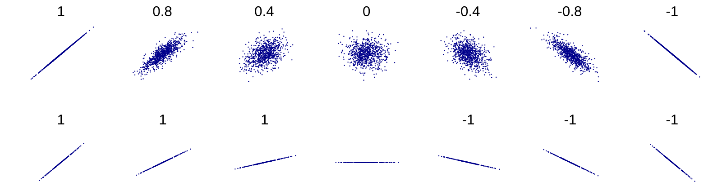
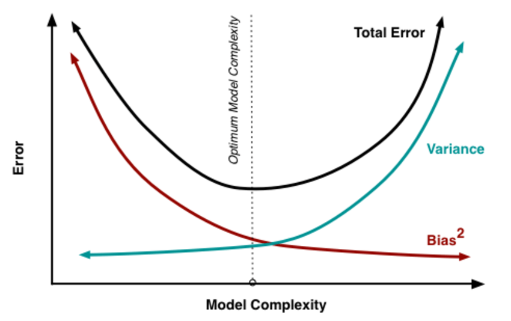

# Simulação Computacional dos Materiais - IFUSP
# Aprendizado de Máquina 1 - Introdução

O objetivo dessa aula é realizar uma introdução ao aprendizado de máquina (AM), ou *machine learning*. A aula irá abordar técnicas básicas de preparação dos dados para posterior obtenção de modelos de classificação ou regressão.

Neste tutorial, vamos utilizar um banco de dados do pacote **scikit-learn** que trata da progressão da diabetes em 442 pacientes. Essa base possuí dez variáveis descritivas como o índice de massa corporal (IMC), pressão arterial e outros seis indicadores obtidos por meio de exames de sangue. A variavel alvo ('y', coluna 11) é uma variável numérica que representa a progressão da doença em 1 ano. Para mais informações, [acesse a documentação](https://scikit-learn.org/stable/datasets/).


### 1) Checando dependências e carregando o banco de dados

Verifique se sua instalação do python 3.8 possui das bibliotecas pandas, scikit-learn, matplolib e seaborn. Caso alguma delas esteja faltando, instale-a utilizando o comando **pip3 install**.

```bash
sudo apt install python3-pip
pip3 list
pip3 install pandas sklearn matplotlib seaborn

```

Abra um novo arquivo e salve-o como **am1.py**.

> vim am1.py

Copie o código a seguir e salve o arquivo:

```python
#!/usr/bin/env python

'''am1.py: Código 1 utilizado na aula de introdução ao AM'''

__author__     = 'Nome ou @usuario'
__email__      = 'e-mail'

# Importando bibliotecas
import pandas as pd
from sklearn.datasets import load_diabetes

# Essas bibliotecas são necessárias para fazer os gráficos
import matplotlib
import matplotlib.pyplot as plt
import numpy as np
import seaborn as sns
plt.style.use('tableau-colorblind10')
plt.rcParams.update({'font.size': 10, 'figure.figsize': (8,4.5)})

## Sec 1. Carregando o banco de dados

x = load_diabetes()
target = 'Y'

# Definindo um título para cada coluna/var
df = pd.DataFrame(x.data, columns=x.feature_names)

print ('\n-- Dados iniciais --\n')
df[target] = x.target    # define a var-alvo
X = df.drop(target, 1)   # X será a matriz de var (features)
y = df[target]           # y será a var-alvo
print(df.head())         # imprime as primeiras linhas do banco de dados 'df'

# Exportando o banco de dados "df" para *.csv - ocpional
df.to_csv(r'Diabetes.csv', index=None, header=True)

# Normalizando os dados
# from sklearn.preprocessing import MinMaxScaler
# scaler = MinMaxScaler(feature_range=(0, 1))
# X = pd.DataFrame(scaler.fit_transform(X), columns=X.columns, index=X.index)

# Imprimindo a matriz de var X (inicial)
print('\nHá {} variáveis descritivas:\n{}'.format(X.shape[1], X.columns.values))

# Uma descrição gráfica simplificada do DF
bins = np.arange(np.floor(y.min()), np.ceil(y.max()), 10)
print (bins)

plt.title('Valores da var-alvo')
plt.hist(y, bins=bins, density=1, alpha=1, label='y')
plt.xlim(xmin= 0, xmax = 350)
plt.locator_params(axis='x', nbins=10)
plt.xlabel('Distribuição de y')
plt.ylabel('Probabilidade')
plt.yticks([])
plt.show()

```

Se você estiver utilizando o **vim**, pressione Ctrl+C, digite **:wq**, e pressione enter para salvar e fechar o arquivo. Depois disso, abra o terminal e execute o código utilizando o **python3**. O programa deve retornar uma breve descrição do banco de dados. No diretório do código, o programa irá salvar o backup *Diabetes.csv*:

> python3 am1.py


### 2) Análise de variáveis descritivas

Após obtenção dos dados que serão utilizados no projeto, é usual realizar uma análise das variáveis descritivas disponíveis, de modo a entender melhor a importância relativa de cada variável. Técnicas de aprendizado de máquina (AM) não-supervisionado são usualmente empregadas nesta etapa (exemplos 2.1 e 2.2). Outra possibilidade é utilizar funções tradicionais de AM supervisionado para rankear as variáveis descritivas (exemplo 2.3), com base em um modelo de referência (ex: regressão linear). Vamos testar alguns desses métodos:

#### 2.1) Matriz de correlação

O coeficiente de correlação de Pearson (PCC) mede o fator de correlação entre duas variáveis, retornando um valor entre -1 e 1. Ele é calculado a partir da covariância de um par de variáveis, dividida pelo produto de seus desvios-padrão. Quanto mais distante de 0, mais similares são as variáveis. Uma ilustração do coeficiente de Pearson pode ser observada abaixo. Outros coeficientes de correlação (Spearman, Kendall) também estão disponíveis no pacote **scikit-learn**, e podem ser utilizados nesta etapa.



Fonte: https://en.wikipedia.org/wiki/Pearson_correlation_coefficient

Agora que já conhecemos mais sobre o PCC, vamos seguir com a implementação em python. Copie e cole os trechos abaixo no arquivo **am1.py** e depois execute o código:

```python
## Sec 2.1. Correlação de Pearson

print ('\n-- Seção 2.1 --\n')
cor = df.corr(method='pearson')    # obtém a matriz de correlação

# Verifica a correlação com a var-alvo 'MEDV'
cor_target = abs(cor[target])
cor_target = cor_target.sort_values()

# Plotando a matriz de correlação
plt.title('Matriz de correlação de Pearson')
sns.heatmap(cor, annot=True, cmap=plt.cm.coolwarm)    # cores divergentes
# sns.heatmap(cor, annot=True, cmap=plt.cm.cubehelix) # cores lineares
plt.show()    # plota a matriz 

# Seleciona vars (features) que possuem alta correlação (>0.4) com a var-alvo
relevant_features = cor_target[cor_target>0.4]
print ('As variáveis com maior PCC em relação a var-alvo são:')
print ('{}\n'.format(relevant_features))

# Algumas var descritivas são fortemente correlacionadas (indesejado)
print ('As variáveis com maior PCC em relação a BMI são:')
cor_BMI = abs(cor['bmi'])
cor_BMI = cor_BMI.sort_values()
print (cor_BMI[cor_BMI>0.4])

# Outro jeito de verificar as correlações (matriz textual)
print ('\nA correlação entre BMI e s5 (lamotrigina) é:')
print(df[["bmi","s5"]].corr())

```

Clique [aqui](https://pandas.pydata.org/pandas-docs/stable/reference/api/pandas.DataFrame.corr.html) para mais informações sobre essa implementação.

#### 2.2) Análise de componentes principais

*Principal component analysis (PCA)* é uma técnica de redução de dimensionalidade muito utilizada para ajudar na interpretação de dados com elevada dimensionalidade. A técnica consiste em encontrar novas variáveis descritivas, minimizando a perda de informação. As variáveis são obtidas a partir de combinações lineares das variáveis iniciais, maximizando sua covariância (ou seja, gerantindo um baixo fator de correlação entre elas).

Adicione o trecho abaixo no arquivo **am1.py**, salve-o e depois execute-o para realizar a análise de componentes principais:

```python
## Sec 2.2. PCA

print ('\n-- Seção 2.2 --\n')

from sklearn.decomposition import PCA

# Nessa notação, os dados não serão convertidos para pandas DFs
diabetes = load_diabetes()
X1 = diabetes.data
y1 = diabetes.target

# Note que a função PCA não recebe os valores de y
pca = PCA(n_components=2) 
X_pca = pca.fit_transform(X1)

print('Componentes de PC1 e PC2: {}\n'.format(abs(pca.components_ )))
print('A variância associada à PC1 e PC2: {}'.format(pca.explained_variance_ratio_))

# Visualização do espaço PCA vs duas variáveis arbitrárias
fig, ax = plt.subplots(1,2)
ps0 = ax[0].scatter(X['bmi'], X['s4'], c=y, cmap=plt.cm.coolwarm)
ax[0].set_xlabel('bmi')
ax[0].set_ylabel('s4')
ax[0].set_title('Antes do PCA')

ps1 = ax[1].scatter(X_pca[:,0], X_pca[:,1], c=y1, cmap=plt.cm.coolwarm)
ax[1].set_xlabel('PC1')
ax[1].yaxis.set_label_position("right")
ax[1].yaxis.tick_right()
ax[1].set_ylabel('PC2')
ax[1].set_title('Depois do PCA')
# fig.colorbar(ps1, ax=axes[1], shrink=0.8)

plt.show()

```

Clique [aqui](https://scikit-learn.org/stable/modules/generated/sklearn.decomposition.PCA.html) para mais informações sobre essa implementação.

#### 2.3) Feature ranking - identificando variáveis relevantes

Chegou a hora de testar técnicas tradicionais de regressão (AM supervisionado). Tratam-se de métodos recursivos de eliminação (**recursive feature elimination, RFE**), que são utilizados para reduzir o número de variáveis criando modelos reduzidos a cada iteração. Essa é uma técnica que permite identificar o número ótimo de variáveis necessárias para modelar uma determinada variável-alvo:

```python
## Sec 2.3. RFECV

print ('\n-- Seção 2.3 --\n')

from sklearn.linear_model import LinearRegression
from sklearn.feature_selection import RFECV

reg = LinearRegression()
rfecv = RFECV(estimator=reg, step=1, cv=5, scoring='neg_mean_squared_error')
# (scoring) alternativos para regressão: 'r2', 'max_error'
rfecv.fit(X, y)

print("Número ótimo de variáveis descritivas: %d" % rfecv.n_features_)

plt.figure()
plt.title('NMSE da regressão linear vs número de variáveis')
plt.xlabel("Número de variáveis descritivas")
plt.ylabel("Desempenho")
plt.plot(range(1, len(rfecv.grid_scores_) + 1), rfecv.grid_scores_)
plt.show()

```

Clique [aqui](https://scikit-learn.org/stable/modules/feature_selection.html) para mais informações sobre essa implementação.

### Perguntas sobre a seção 2

Na sua opinião, quantas variáveis descritivas são necessárias para modelar a variável y? Quais variáveis descritivas podem ser consideradas as mais importantes?

Dica: use outras paletas de cores para visualizar a matriz de correlação


### 3) Regressão linear

O objetivo final desse projeto é realizar uma regressão e obter um modelo que possa prever a evolução da diabetes com base nas variáveis disponíveis. Normalmente, um modelo de regressão linear é simples demais para descrever problemas tão complexos, mas ele pode fornecer uma boa base de comparação. Além disso, ao realizar um ajuste linear (*fitting*), é possível recuperar a importância isolada de cada variável para o modelo, como mostrado abaixo:

```python
## Sec 3. Regressão linear

print ('\n-- Seção 3 --\n')
from sklearn.feature_selection import SelectKBest
from sklearn.feature_selection import f_regression

bestfeatures = SelectKBest(score_func=f_regression, k=5)
fit = bestfeatures.fit(X, y)
dfscores = pd.DataFrame(fit.scores_)
dfcolumns = pd.DataFrame(X.columns)

# concatena os dois dataframes para facilitar a visualização
featureScores = pd.concat([dfcolumns, dfscores], axis=1)
featureScores.columns = ['Variável','Score'] # nome para as colunas
print('Seleção univariável:')
print(featureScores.nlargest(10,'Score'))    # 10 melhores parâmetros

# Plotando para melhor visualização

feature_scores = pd.Series(fit.scores_, index=X.columns)
feature_scores.nlargest(5).plot(kind='barh')
plt.title('Variáveis selecionadas via regressão univariável (SelectKBest)')
plt.show()

```

### 4) Regressão linear com penalização (LASSO)

Uma das melhores maneiras de melhorar a capacidade preditiva de modelos lineares é utilizar técnicas de penalização para buscar soluções mais esparsas, i.e. evitar que o modelo fique dependente de apenas 1 variável. A regularização LASSO (penalização L1) limita a soma dos valores absolutos dos coeficientes de regressão, forçando alguns coeficientes à zero. Isso possibilita melhorar a capacidade preditiva do modelo, simplificando-o. Para saber mais sobre penalizações, acesse esse artigo do [Datacamp](https://www.datacamp.com/community/tutorials/tutorial-ridge-lasso-elastic-net). Alternativas para essa etapa seriam utilizar outras técnicas de regularização, como RidgeRegression e ElasticNet.



Fonte: https://datacamp.com

A implementação pode ser encontrada abaixo:

```python
## Sec 4. Penalização
print ('\n-- Seção 3 --\n')
from sklearn.linear_model import LinearRegression
from sklearn.linear_model import LassoCV, Lasso
from sklearn import metrics

reg = LassoCV(cv=5)
reg.fit(X, y)
print('Melhor score utilizando LassoCV com cv=5: %f' % reg.score(X,y))
coef = pd.Series(reg.coef_, index = X.columns)

print ('\nCoeficientes LassoCV:\n')
print (coef)
print('A rotina Lasso eliminaria ' +  str(sum(coef == 0)) + ' variáveis')

imp_coef = coef.sort_values()
imp_coef.plot(kind = "barh")
plt.title('Score das variáveis via regressão LassoCV')
plt.show()

y_pred = reg.predict(X)
mae = metrics.mean_absolute_error(y, y_pred)
print('Erro (MAE) utilizando todas as variaveis %f' % mae)

X = X[['bmi', 'bp', 's5', 's4', 's6', 's1']] # s2, s3, age and sex excluded
reg.fit(X, y)
y_pred = reg.predict(X)
mae = metrics.mean_absolute_error(y, y_pred)
print('Erro (MAE) utilizando 6/10 var. selecionadas  %f' % mae)

```

### 5) Discussão

Você já esteve envolvido em algum projeto de ciência de dados? Qual foi o papel da seleção de variáveis nesse projeto? Discutir um pouco sobre a simplificação de modelos e a maldição da dimensionalidade. Ler **[Curse of dimensionality](https://en.wikipedia.org/wiki/Curse_of_dimensionality)**.

Na próxima aula, vamos analisar um banco de dados do Materials Project e aplicar as técnicas apresentadas em um problema de regressão.


### 6) Referências

- Principal component analysis: a review and recent developments (2016): https://royalsocietypublishing.org/doi/10.1098/rsta.2015.0202
- Towards Data Science: https://towardsdatascience.com/
- SciPy lectures: https://scipy-lectures.org/
